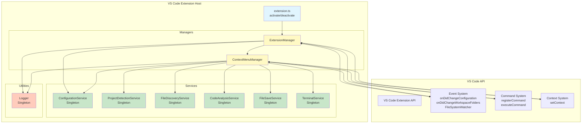
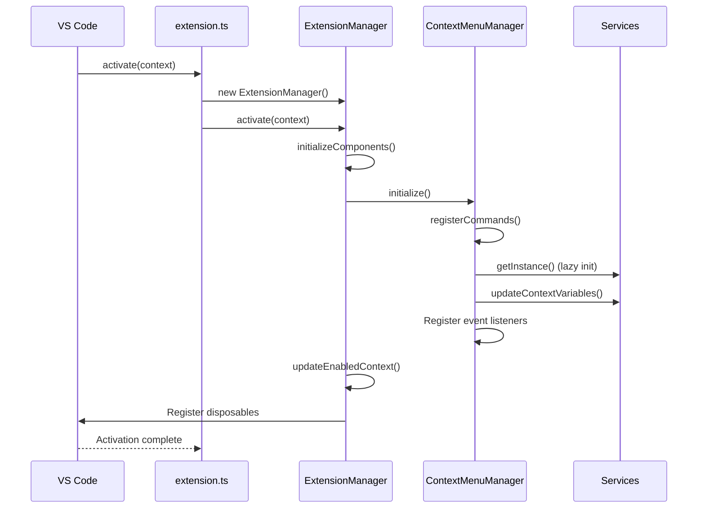
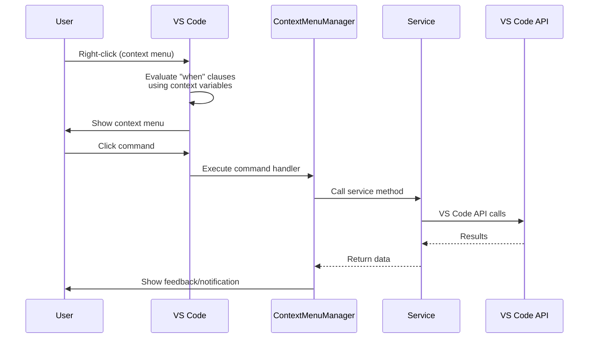

# Architecture Documentation

## Overview

The Additional Context Menus extension follows a **Service-Oriented Architecture (SOA)** with a **Manager Pattern** coordination layer. This architecture promotes separation of concerns, maintainability, and testability by organizing code into distinct, single-responsibility components.

### Key Architectural Characteristics

- **Service-Oriented Architecture**: Core functionality encapsulated in singleton services
- **Manager Pattern**: Managers coordinate services and handle VS Code API integration
- **Event-Driven Activation**: Extension responds to VS Code lifecycle and user events
- **Singleton Services**: All services use the singleton pattern for consistent state management
- **Disposable Pattern**: Proper resource cleanup through VS Code's disposable mechanism
- **Context-Based UI**: Dynamic menu visibility using VS Code context variables

## System Architecture



## Component Hierarchy

### Entry Point

**`src/extension.ts`**
- VS Code extension activation and deactivation entry point
- Creates and manages `ExtensionManager` lifecycle
- Handles activation errors gracefully

### Managers

**`ExtensionManager`** (`src/managers/ExtensionManager.ts`)
- **Role**: Main coordinator for extension lifecycle
- **Responsibilities**:
  - Extension activation and deactivation
  - Component initialization coordination
  - Configuration change handling
  - Context variable management for enable/disable state
  - Disposable resource management
- **Lifecycle**: Created on activation, disposed on deactivation

**`ContextMenuManager`** (`src/managers/ContextMenuManager.ts`)
- **Role**: Command registration and service coordination
- **Responsibilities**:
  - Register all extension commands
  - Handle command execution
  - Coordinate services to fulfill commands
  - Manage event listeners (configuration, workspace, file system)
  - Import merging logic
- **Lifecycle**: Created by ExtensionManager, disposed on deactivation

### Services

All services implement the **Singleton Pattern** with `getInstance()` and private constructors.

**`ConfigurationService`** (`src/services/configurationService.ts`)
- **Purpose**: Centralized configuration management
- **Key Methods**:
  - `getConfiguration()`: Retrieve current configuration
  - `isEnabled()`: Check if extension is enabled
  - `onConfigurationChanged()`: Subscribe to configuration changes
  - `updateConfiguration()`: Update configuration values
- **State**: No persistent state (reads from VS Code configuration)

**`ProjectDetectionService`** (`src/services/projectDetectionService.ts`)
- **Purpose**: Detect project type and framework
- **Key Methods**:
  - `detectProjectType()`: Analyze workspace and detect project type
  - `updateContextVariables()`: Set context variables for menu visibility
  - `clearCache()`: Clear project type cache
  - `onWorkspaceChanged()`: Subscribe to workspace folder changes
- **State**: Caches detected project type per workspace folder
- **Frameworks Detected**: React, Angular, Express, Next.js, Vue, Svelte, NestJS

**`FileDiscoveryService`** (`src/services/fileDiscoveryService.ts`)
- **Purpose**: Find and validate compatible files
- **Key Methods**:
  - `getCompatibleFiles()`: Search for files with matching extensions
  - `validateTargetFile()`: Check file accessibility and write permissions
  - `showFileSelector()`: Display file picker UI
  - `clearCache()`: Clear file cache
  - `onFileSystemChanged()`: Subscribe to file system changes
- **State**: Caches file lists with automatic invalidation on changes

**`CodeAnalysisService`** (`src/services/codeAnalysisService.ts`)
- **Purpose**: Analyze code structure (functions, imports)
- **Key Methods**:
  - `findFunctionAtPosition()`: Locate function containing cursor position
  - `extractImports()`: Extract import statements from code
- **Design Decision**: Uses regex patterns instead of Babel to avoid 500KB+ dependency
- **State**: No persistent state (stateless analysis)

**`FileSaveService`** (`src/services/fileSaveService.ts`)
- **Purpose**: Handle save operations for multiple files
- **Key Methods**:
  - `saveAllFiles()`: Save all dirty files with progress tracking
  - `saveWithProgress()`: Save with progress indication
- **State**: No persistent state (stateless operations)

**`TerminalService`** (`src/services/terminalService.ts`)
- **Purpose**: Cross-platform terminal integration
- **Key Methods**:
  - `openInTerminal()`: Open terminal at specific path
  - `openDirectoryInTerminal()`: Open directory in terminal
- **Terminal Types**: Integrated, External, System-default
- **State**: No persistent state (stateless operations)

### Utilities

**`Logger`** (`src/utils/logger.ts`)
- **Purpose**: Centralized logging with output channel
- **Log Levels**: DEBUG, INFO, WARN, ERROR
- **Features**:
  - VS Code output channel integration
  - Console logging in development mode
  - Consistent log format with context
- **State**: Maintains output channel reference

## Architectural Patterns

### 1. Singleton Pattern

All services use the singleton pattern to ensure:
- Single instance per extension lifetime
- Global access point without dependency injection complexity
- Consistent state management

**Implementation Pattern:**
```typescript
class Service {
  private static instance: Service;

  private constructor() {
    // Initialize
  }

  public static getInstance(): Service {
    if (!Service.instance) {
      Service.instance = new Service();
    }
    return Service.instance;
  }
}
```

**Benefits:**
- Prevents duplicate instances
- Simplifies access (no need to pass instances around)
- Enables state sharing across components

**Trade-offs:**
- Tight coupling (consumers directly reference concrete classes)
- Harder to mock in tests (though possible with test-specific setup)
- Global state management concerns

### 2. Manager Pattern

Managers act as a coordination layer between VS Code API and services:
- **ExtensionManager**: High-level lifecycle and configuration management
- **ContextMenuManager**: Command registration and service orchestration

**Responsibilities:**
- Coordinate service calls to fulfill complex operations
- Handle VS Code API interactions (events, commands, context)
- Manage disposable resources for cleanup
- Provide high-level error handling

**Benefits:**
- Separation of concerns (services don't know about VS Code API)
- Easier testing (services can be tested independently)
- Clear ownership of functionality

### 3. Disposable Pattern

All managers and some services implement proper cleanup:
- Implement `dispose()` method
- Register disposables with VS Code context
- Clean up event listeners, watchers, and resources

**Implementation:**
```typescript
class Component {
  private disposables: vscode.Disposable[] = [];

  public dispose(): void {
    this.disposables.forEach(d => d.dispose());
    this.disposables = [];
  }
}
```

**Benefits:**
- Prevents memory leaks
- Proper resource cleanup on deactivation
- VS Code best practices compliance

### 4. Event-Driven Architecture

The extension responds to VS Code events:
- **Configuration Changes**: `onDidChangeConfiguration`
- **Workspace Changes**: `onDidChangeWorkspaceFolders`
- **File System Changes**: `FileSystemWatcher`

**Pattern:**
```typescript
this.disposables.push(
  this.service.onEvent(() => {
    // Handle event
  })
);
```

**Benefits:**
- Reactive updates without polling
- Efficient resource usage
- Consistent state across changes

### 5. Context-Based UI

Dynamic menu visibility using VS Code context variables:
- `additionalContextMenus.enabled`: Extension enabled state
- `additionalContextMenus.isNodeProject`: Node.js project detected
- `additionalContextMenus.hasReact`: React framework detected
- `additionalContextMenus.hasAngular`: Angular framework detected
- `additionalContextMenus.hasExpress`: Express framework detected
- `additionalContextMenus.hasNextjs`: Next.js framework detected
- `additionalContextMenus.hasTypeScript`: TypeScript detected

**Usage in package.json:**
```json
{
  "when": "editorTextFocus && additionalContextMenus.enabled && additionalContextMenus.isNodeProject"
}
```

**Benefits:**
- Menus only show in relevant contexts
- Better user experience
- Reduces clutter

## VS Code API Integration

### Extension Lifecycle



### Command Registration Flow



## Design Decisions and Trade-offs

### 1. Service-Oriented vs. Monolithic

**Decision**: Use service-oriented architecture with singleton services.

**Rationale**:
- Clear separation of concerns
- Easier to maintain and test
- Services can be reused across different commands
- Simplifies adding new features

**Trade-offs**:
- More files and indirection
- Slightly more complex initialization
- Need to manage service lifecycle

### 2. Regex vs. Babel for Code Analysis

**Decision**: Use regex patterns for function detection instead of Babel parser.

**Rationale**:
- Babel adds 500KB+ to bundle size
- Regex is sufficient for common function patterns
- Faster parsing for simple cases
- Reduces extension load time

**Trade-offs**:
- Less accurate for edge cases
- May not support all JavaScript/TypeScript features
- Harder to maintain complex regex patterns

### 3. Singleton vs. Dependency Injection

**Decision**: Use singleton pattern with `getInstance()` instead of DI framework.

**Rationale**:
- Simpler for VS Code extensions
- No need for additional DI dependencies
- VS Code extensions are single-instance anyway
- Easier to understand for contributors

**Trade-offs**:
- Tighter coupling
- Harder to mock in tests
- Global state management

### 4. Event Listeners vs. Polling

**Decision**: Use VS Code event listeners instead of polling.

**Rationale**:
- More efficient (no constant polling)
- Immediate response to changes
- VS Code API provides rich event system
- Lower resource usage

**Trade-offs**:
- Must properly dispose listeners
- Event-driven flow is harder to debug
- Need to handle event bursts

### 5. Context Variables for Menu Visibility

**Decision**: Use VS Code context variables and "when" clauses for menu visibility.

**Rationale**:
- Native VS Code mechanism
- Efficient (evaluated by VS Code)
- Cleaner than manual command registration/deregistration
- Supports complex boolean expressions

**Trade-offs**:
- Must keep context variables in sync
- Debugging visibility issues can be tricky
- Requires upfront detection of project type

## Component Communication

### Manager-to-Service Communication

- **Pattern**: Direct method calls
- **Direction**: Managers call services, not vice versa
- **Example**: `ContextMenuManager` → `ProjectDetectionService.detectProjectType()`

### Service-to-Service Communication

- **Pattern**: Services don't directly call each other
- **Coordination**: Managers coordinate multiple services
- **Example**: `ContextMenuManager` calls both `FileDiscoveryService` and `CodeAnalysisService` for "Copy Function"

### Event-Based Communication

- **Pattern**: Services emit events, managers subscribe
- **Example**: `ConfigurationService.onConfigurationChanged()` → `ExtensionManager` handles

### State Sharing

- **Pattern**: Services maintain their own state (caches)
- **Synchronization**: Cache invalidation on events
- **Example**: `FileDiscoveryService` cache cleared on file system changes

## Extension Lifecycle

### Activation Flow

1. **VS Code** calls `activate(context)` in `extension.ts`
2. **extension.ts** creates `ExtensionManager`
3. **ExtensionManager.activate()**:
   - Initializes `ContextMenuManager`
   - Registers configuration change listener
   - Updates enabled context variable
   - Registers all disposables with VS Code context
4. **ContextMenuManager.initialize()**:
   - Registers all commands
   - Updates project detection context variables
   - Registers event listeners (configuration, workspace, file system)
5. Extension is now **active**

### Deactivation Flow

1. **VS Code** calls `deactivate()` in `extension.ts`
2. **extension.ts** calls `ExtensionManager.deactivate()`
3. **ExtensionManager.dispose()**:
   - Disposes `ContextMenuManager`
   - Disposes all registered disposables
   - Disposes logger
4. All resources cleaned up, extension is **inactive**

## Error Handling Strategy

### Layered Error Handling

1. **Service Layer**: Services log errors and throw/return error results
2. **Manager Layer**: Managers catch errors, show user notifications
3. **Extension Layer**: Top-level error handling for activation failures

### Pattern

```typescript
try {
  // Operation
} catch (error) {
  this.logger.error('Error description', error);
  vscode.window.showErrorMessage('User-friendly message');
}
```

### Error Notification

- **Service Errors**: Logged to output channel
- **User-Facing Errors**: Shown via `vscode.window.showErrorMessage()`
- **Warnings**: Shown via `vscode.window.showWarningMessage()`
- **Info**: Shown via `vscode.window.showInformationMessage()`

## Performance Considerations

### Caching Strategy

- **ProjectDetectionService**: Caches detected project type per workspace
- **FileDiscoveryService**: Caches file lists with automatic invalidation
- **ConfigurationService**: No cache (reads directly from VS Code)

### Lazy Initialization

- Services created on first `getInstance()` call
- Reduces activation time
- Only initializes used services

### Event Debouncing

- File system changes trigger cache invalidation
- Multiple rapid changes only trigger one re-scan
- Prevents excessive file system operations

### Regex Performance

- Pre-compiled regex patterns in `CodeAnalysisService`
- Efficient string matching for function detection
- Avoids expensive AST parsing

## Security Considerations

### File System Access

- **Validation**: `FileDiscoveryService.validateTargetFile()` checks permissions
- **Error Handling**: Graceful handling of access denied errors
- **User Confirmation**: File picker UI for explicit user selection

### Terminal Execution

- **No arbitrary command execution**: TerminalService only opens terminal
- **No shell injection**: Uses VS Code terminal API (safe)
- **User Control**: Terminal type and behavior configurable

### Code Analysis

- **No code execution**: `CodeAnalysisService` only analyzes text
- **No eval()**: Safe regex-based parsing
- **Local operations**: All analysis done locally

## Testing Strategy

### Unit Testing

- Test services in isolation
- Mock VS Code API using test doubles
- Test singleton pattern and state management

### Integration Testing

- Test command execution flow
- Test service coordination through managers
- Test event handling

### E2E Testing

- Test extension activation
- Test command execution in real VS Code instance
- Test UI interactions (context menus, notifications)

## Future Extensibility

### Adding New Commands

1. Add command to `package.json` contributes
2. Register handler in `ContextMenuManager.registerCommands()`
3. Implement handler method using existing services
4. Update context variables if needed

### Adding New Services

1. Create service class with singleton pattern
2. Add `getInstance()` and private constructor
3. Implement `dispose()` if needed
4. Inject into `ContextMenuManager` or `ExtensionManager`
5. Use in command handlers

### Adding New Frameworks

1. Add detection logic to `ProjectDetectionService.detectFrameworks()`
2. Add context variable to `ProjectDetectionService.updateContextVariables()`
3. Add "when" clause to `package.json` menu items
4. Test framework detection

## Architectural Principles

### 1. Separation of Concerns

- Each component has a single, well-defined responsibility
- Managers coordinate, services implement functionality
- Utilities provide cross-cutting concerns

### 2. Single Responsibility Principle

- Services focus on one domain (files, projects, configuration)
- Managers focus on coordination
- No component does too much

### 3. DRY (Don't Repeat Yourself)

- Singleton services prevent duplicate instances
- Shared logger across all components
- Common patterns reused across services

### 4. VS Code Best Practices

- Proper disposable management
- Context variables for UI state
- Event-driven architecture
- Native VS Code APIs where possible

### 5. Maintainability

- Clear naming conventions
- Consistent patterns across components
- Comprehensive logging
- Type safety with TypeScript

## Conclusion

This architecture provides a solid foundation for the Additional Context Menus extension:

- **Service-Oriented**: Clear separation of concerns
- **Manager Coordination**: Clean VS Code API integration
- **Singleton Services**: Consistent state management
- **Event-Driven**: Reactive and efficient
- **Disposable Pattern**: Proper resource cleanup
- **Context-Based UI**: Dynamic menu visibility

The architecture balances simplicity, maintainability, and performance while following VS Code extension best practices. New contributors can understand the system quickly, and the design supports future enhancements without major refactoring.
