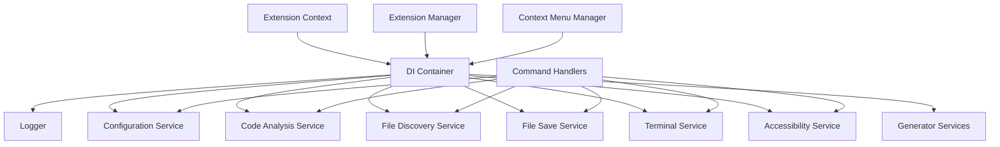

# Dependency Injection

## Overview

The extension uses a lightweight Dependency Injection (DI) container to manage service lifecycles and dependencies. This replaces the manual singleton pattern with proper dependency injection, improving testability and maintainability.

## Before: Manual Singleton Pattern

```typescript
// Old pattern - manual singleton with getInstance()
export class ConfigurationService {
  private static instance: ConfigurationService;

  public static getInstance(): ConfigurationService {
    if (!ConfigurationService.instance) {
      ConfigurationService.instance = new ConfigurationService();
    }
    return ConfigurationService.instance;
  }

  private constructor() {}
}

// Usage - tight coupling
const config = ConfigurationService.getInstance();
```

**Problems:**

1. **Tight Coupling**: Services directly reference each other
2. **Hard to Test**: Can't mock dependencies in tests
3. **Hidden Dependencies**: Dependencies not visible from constructors
4. **Circular Dependencies**: Difficult to detect and resolve

## After: Dependency Injection

### DI Container

```typescript
// Lightweight DI container (no external dependencies)
export class DIContainer {
  private readonly services = new Map<symbol, ServiceDescriptor>();

  public registerSingleton<T>(token: symbol, factory: () => T): void {
    this.services.set(token, {
      factory,
      lifecycle: 'singleton',
    });
  }

  public get<T>(token: symbol): T {
    const descriptor = this.services.get(token);
    if (!descriptor) {
      throw new Error(`Service not registered: ${token.description}`);
    }
    return descriptor.factory() as T;
  }
}
```

### Service Interfaces

All services now implement interfaces for clear contracts:

```typescript
// src/di/interfaces/IConfigurationService.ts
export interface IConfigurationService {
  getConfiguration(): ExtensionConfig;
  getConfigurationTyped(): ExtensionConfiguration;
  getCopyCodeConfig(): CopyCodeConfig;
  getSaveAllConfig(): SaveAllConfig;
  onDidChangeConfiguration: vscode.Event<void>;
}

// Service implements the interface
export class ConfigurationService implements IConfigurationService {
  constructor(private readonly outputChannel: vscode.OutputChannel) {}

  public static create(outputChannel: vscode.OutputChannel): IConfigurationService {
    return new ConfigurationService(outputChannel);
  }

  // ... implementation
}
```

### DI Types

```typescript
// src/di/types.ts - Type-safe service tokens
export const TYPES = {
  Logger: Symbol('Logger'),
  ConfigurationService: Symbol('ConfigurationService'),
  ProjectDetectionService: Symbol('ProjectDetectionService'),
  FileDiscoveryService: Symbol('FileDiscoveryService'),
  CodeAnalysisService: Symbol('CodeAnalysisService'),
  FileSaveService: Symbol('FileSaveService'),
  TerminalService: Symbol('TerminalService'),
  AccessibilityService: Symbol('AccessibilityService'),
  EnumGeneratorService: Symbol('EnumGeneratorService'),
  EnvFileGeneratorService: Symbol('EnvFileGeneratorService'),
  CronJobTimerGeneratorService: Symbol('CronJobTimerGeneratorService'),
  FileNamingConventionService: Symbol('FileNamingConventionService'),
};
```

### Container Initialization

```typescript
// src/di/container.ts
export async function initializeContainer(context: vscode.ExtensionContext): Promise<void> {
  const outputChannel = vscode.window.createOutputChannel('Additional Context Menus');

  // Register Logger first (other services depend on it)
  container.registerSingleton<ILogger>(TYPES.Logger, () => Logger.create(undefined, outputChannel));

  // Register ConfigurationService
  container.registerSingleton<IConfigurationService>(TYPES.ConfigurationService, () =>
    ConfigurationService.create(outputChannel),
  );

  // Register other services...
  // Each service receives its dependencies via constructor
}
```

## Usage Examples

### Getting Services from Container

```typescript
import { getService } from '../di/container';
import { TYPES } from '../di/types';

// Get a service
const configService = getService<IConfigurationService>(TYPES.ConfigurationService);
const copyConfig = configService.getCopyCodeConfig();
```

### Creating Commands with DI

```typescript
import { getService } from '../di/container';
import { TYPES } from '../di/types';

export class CopyFunctionCommand extends BaseCommandHandler {
  constructor() {
    const codeAnalysisService = getService<ICodeAnalysisService>(TYPES.CodeAnalysisService);
    const accessibilityService = getService<IAccessibilityService>(TYPES.AccessibilityService);
    const logger = getService<ILogger>(TYPES.Logger);

    super('CopyFunction', logger, accessibilityService);
    this.codeAnalysisService = codeAnalysisService;
  }
}
```

## Benefits

| Feature          | Before                            | After                            |
| ---------------- | --------------------------------- | -------------------------------- |
| **Coupling**     | Tight coupling with getInstance() | Loose coupling via DI            |
| **Testing**      | Hard to mock dependencies         | Easy to inject mocks             |
| **Dependencies** | Hidden in getInstance()           | Visible in constructors          |
| **Lifecycle**    | Manual singleton management       | Automatic lifecycle management   |
| **Type Safety**  | No compile-time checks            | Full type safety with interfaces |

## Migration Notes

### Backward Compatibility

The old singleton pattern is preserved for gradual migration:

```typescript
// Old code still works
const config = ConfigurationService.getInstance();

// New code uses DI
const config = getService<IConfigurationService>(TYPES.ConfigurationService);
```

### Migration Path

1. **Phase 1**: Add interfaces and DI container (DONE)
2. **Phase 2**: Update services to support both patterns (DONE)
3. **Phase 3**: Gradually migrate consumers to use DI
4. **Phase 4**: Remove legacy `getInstance()` methods (future)

## Architecture Diagram



## Best Practices

### 1. Constructor Injection

```typescript
// GOOD - Dependencies in constructor
export class MyService implements IMyService {
  constructor(
    private readonly logger: ILogger,
    private readonly config: IConfigurationService,
  ) {}
}

// BAD - Service location in methods
export class MyService implements IMyService {
  public doSomething() {
    const logger = getService<ILogger>(TYPES.Logger); // Don't do this
  }
}
```

### 2. Interface-Based Design

```typescript
// GOOD - Depend on interfaces
constructor(private readonly config: IConfigurationService) {}

// BAD - Depend on concrete classes
constructor(private readonly config: ConfigurationService) {}
```

### 3. Single Responsibility

Each service should have one clear purpose. If a service needs too many dependencies, consider splitting it.

## See Also

- [Command Handlers](/architecture/command-handlers)
- [Type Safety](/architecture/type-safety)
- [Adding Commands](/developer-guides/adding-commands)
