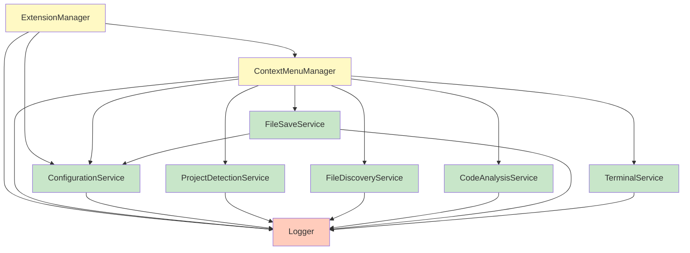

# Component Reference Documentation

## Overview

This document provides detailed API documentation for all components in the Additional Context Menus extension. Each component includes its responsibilities, public API, lifecycle, usage examples, and type definitions.

## Table of Contents

- [Managers](#managers)
  - [ExtensionManager](#extensionmanager)
  - [ContextMenuManager](#contextmenumanager)
- [Services](#services)
  - [ConfigurationService](#configurationservice)
  - [ProjectDetectionService](#projectdetectionservice)
  - [FileDiscoveryService](#filediscoveryservice)
  - [CodeAnalysisService](#codeanalysisservice)
  - [FileSaveService](#filesave-service)
  - [TerminalService](#terminalservice)
- [Utilities](#utilities)
  - [Logger](#logger)
- [Type Definitions](#type-definitions)

---

## Managers

### ExtensionManager

**File:** `src/managers/ExtensionManager.ts`

**Role:** Main coordinator for extension lifecycle and VS Code API integration.

**Responsibilities:**
- Extension activation and deactivation
- Component initialization coordination
- Configuration change handling
- Context variable management for enable/disable state
- Disposable resource management
- Error handling and user notifications

**Lifecycle:**
- Created on extension activation
- Initializes ContextMenuManager
- Registers event listeners
- Disposed on extension deactivation

#### Public API

##### `constructor()`

Creates a new ExtensionManager instance with lazy service initialization.

```typescript
constructor()
```

**Initializes:**
- Logger (singleton)
- ConfigurationService (singleton)
- ContextMenuManager (new instance)

**Example:**
```typescript
const extensionManager = new ExtensionManager();
```

---

##### `activate(context: vscode.ExtensionContext): Promise<void>`

Activates the extension and initializes all components.

```typescript
public async activate(context: vscode.ExtensionContext): Promise<void>
```

**Parameters:**
- `context` - VS Code extension context for registering subscriptions

**Throws:**
- Error if activation fails

**Side Effects:**
- Initializes ContextMenuManager
- Registers configuration change listener
- Sets `additionalContextMenus.enabled` context variable
- Registers all disposables with VS Code context
- Shows activation message in development mode

**Example:**
```typescript
await extensionManager.activate(context);
```

---

##### `deactivate(): void`

Deactivates the extension and cleans up resources.

```typescript
public deactivate(): void
```

**Side Effects:**
- Calls `dispose()` to clean up all resources
- Logs deactivation

**Example:**
```typescript
extensionManager.deactivate();
```

---

##### `getContextMenuManager(): ContextMenuManager`

Gets the ContextMenuManager instance.

```typescript
public getContextMenuManager(): ContextMenuManager
```

**Returns:** ContextMenuManager instance

**Example:**
```typescript
const menuManager = extensionManager.getContextMenuManager();
```

---

##### `getConfigurationService(): ConfigurationService`

Gets the ConfigurationService instance.

```typescript
public getConfigurationService(): ConfigurationService
```

**Returns:** ConfigurationService instance

**Example:**
```typescript
const configService = extensionManager.getConfigurationService();
```

---

##### `isActive(): boolean`

Checks if the extension is currently enabled.

```typescript
public isActive(): boolean
```

**Returns:** `true` if extension is enabled, `false` otherwise

**Example:**
```typescript
if (extensionManager.isActive()) {
  // Extension is enabled
}
```

---

#### Private Methods

##### `initializeComponents(): Promise<void>`

Initializes all components (ContextMenuManager and event listeners).

##### `handleConfigurationChanged(): Promise<void>`

Handles configuration change events by updating context variables.

##### `updateEnabledContext(): Promise<void>`

Updates the `additionalContextMenus.enabled` context variable.

##### `dispose(): void`

Disposes all resources including ContextMenuManager, disposables array, and Logger.

---

### ContextMenuManager

**File:** `src/managers/ContextMenuManager.ts`

**Role:** Command registration and service coordination for all user-facing commands.

**Responsibilities:**
- Register all extension commands with VS Code
- Handle command execution and coordinate services
- Manage event listeners (configuration, workspace, file system)
- Code insertion and import merging logic
- File selection and validation
- User feedback and error handling

**Lifecycle:**
- Created by ExtensionManager
- Initializes all services via `getInstance()`
- Registers commands and event listeners
- Disposed on extension deactivation

#### Registered Commands

| Command ID | Handler | Purpose |
|------------|---------|---------|
| `additionalContextMenus.copyFunction` | `handleCopyFunction()` | Copy function at cursor to clipboard |
| `additionalContextMenus.copyLinesToFile` | `handleCopyLinesToFile()` | Copy selected lines to target file |
| `additionalContextMenus.moveLinesToFile` | `handleMoveLinesToFile()` | Move selected lines to target file |
| `additionalContextMenus.saveAll` | `handleSaveAll()` | Save all dirty files |
| `additionalContextMenus.enable` | `handleEnable()` | Enable the extension |
| `additionalContextMenus.disable` | `handleDisable()` | Disable the extension |
| `additionalContextMenus.openInTerminal` | `handleOpenInTerminal()` | Open terminal at file location |

#### Public API

##### `constructor()`

Creates a new ContextMenuManager with lazy service initialization.

```typescript
constructor()
```

**Initializes:**
- All services via `getInstance()`: Logger, ConfigurationService, ProjectDetectionService, FileDiscoveryService, FileSaveService, CodeAnalysisService, TerminalService

---

##### `initialize(): Promise<void>`

Initializes the manager by registering commands and event listeners.

```typescript
public async initialize(): Promise<void>
```

**Side Effects:**
- Registers all 7 commands
- Updates project detection context variables
- Registers configuration change listener
- Registers workspace change listener
- Registers file system watcher

**Example:**
```typescript
await contextMenuManager.initialize();
```

---

##### `dispose(): void`

Disposes all event listeners and watchers.

```typescript
public dispose(): void
```

**Side Effects:**
- Disposes all items in `disposables` array
- Clears `disposables` array

---

#### Command Handlers

##### `handleCopyFunction(): Promise<void>`

Copies the function at the current cursor position to the clipboard.

```typescript
private async handleCopyFunction(): Promise<void>
```

**Flow:**
1. Validates active editor exists
2. Gets cursor position
3. Calls `CodeAnalysisService.findFunctionAtPosition()`
4. Copies function text to clipboard
5. Shows success message with function name and type
6. Logs success or error

**User Feedback:**
- Error: "No active editor found"
- Warning: "No function found at cursor position"
- Success: "Copied {type} '{name}' to clipboard"

**Example:**
```typescript
// User triggers command via context menu
// Handler automatically called by VS Code
```

---

##### `handleCopyLinesToFile(): Promise<void>`

Copies selected lines of code to a target file.

```typescript
private async handleCopyLinesToFile(): Promise<void>
```

**Flow:**
1. Validates active editor and text selection
2. Gets source file extension
3. Calls `FileDiscoveryService.getCompatibleFiles()`
4. Shows file picker via `FileDiscoveryService.showFileSelector()`
5. Validates target file via `FileDiscoveryService.validateTargetFile()`
6. Inserts code at determined position (smart/beginning/end)
7. Handles import merging if configured
8. Shows success message

**Insertion Points:**
- `smart`: After imports, before exports (default)
- `beginning`: Start of file
- `end`: End of file

**User Feedback:**
- Error: "No active editor found", "Target file is not accessible"
- Warning: "No code selected", "No compatible files found"
- Success: "Lines copied to {filename}"

---

##### `handleMoveLinesToFile(): Promise<void>`

Moves selected lines of code to a target file (same as copy, but removes from source).

```typescript
private async handleMoveLinesToFile(): Promise<void>
```

**Flow:**
Same as `handleCopyLinesToFile()`, plus:
- Deletes selected text from source file after copying

**Additional Step:**
```typescript
await editor.edit((editBuilder) => {
  editBuilder.delete(selection);
});
```

---

##### `handleSaveAll(): Promise<void>`

Saves all dirty files in the workspace.

```typescript
private async handleSaveAll(): Promise<void>
```

**Flow:**
1. Calls `FileSaveService.saveAllFiles()`
2. Logs result
3. Service handles user feedback

**Delegates to:** FileSaveService

---

##### `handleEnable(): Promise<void>`

Enables the extension via configuration.

```typescript
private async handleEnable(): Promise<void>
```

**Flow:**
1. Calls `ConfigurationService.updateConfiguration('enabled', true)`
2. Shows "Additional Context Menus enabled" message

**Side Effects:**
- Triggers `onDidChangeConfiguration` event
- Context variables updated automatically

---

##### `handleDisable(): Promise<void>`

Disables the extension via configuration.

```typescript
private async handleDisable(): Promise<void>
```

**Flow:**
1. Calls `ConfigurationService.updateConfiguration('enabled', false)`
2. Shows "Additional Context Menus disabled" message

**Side Effects:**
- Triggers `onDidChangeConfiguration` event
- Context variables updated automatically
- Menu items hidden via when clauses

---

##### `handleOpenInTerminal(): Promise<void>`

Opens a terminal at the current file's location.

```typescript
private async handleOpenInTerminal(): Promise<void>
```

**Flow:**
1. Validates active editor
2. Gets file path
3. Calls `TerminalService.openInTerminal(filePath)`

**User Feedback:**
- Error: "No active editor found", "Failed to open terminal"
- Success: "Terminal opened in {directory}"

---

#### Helper Methods

##### `copyCodeToTargetFile(code, targetFilePath, sourceDocument): Promise<void>`

Inserts code into target file at the determined position.

```typescript
private async copyCodeToTargetFile(
  code: string,
  targetFilePath: string,
  sourceDocument: vscode.TextDocument
): Promise<void>
```

**Steps:**
1. Opens target document
2. Determines insertion point based on config
3. Opens target in editor (beside view)
4. Inserts code with newlines
5. Handles import merging if configured

---

##### `getInsertionPoint(document, code): vscode.Position`

Determines where to insert code based on configuration.

```typescript
private getInsertionPoint(document: vscode.TextDocument, code: string): vscode.Position
```

**Returns:** Position for code insertion

**Logic:**
- `beginning`: Position(0, 0)
- `end`: Position(lineCount, 0)
- `smart`: Calls `findSmartInsertionPoint()`

---

##### `findSmartInsertionPoint(document): vscode.Position`

Finds the optimal insertion point (after imports, before exports).

```typescript
private findSmartInsertionPoint(document: vscode.TextDocument): vscode.Position
```

**Algorithm:**
1. Scan lines for `import` statements
2. Scan lines for `export` statements
3. Return position after last import, or before first export, or at end

---

##### `handleImportMerging(sourceDocument, targetDocument, copiedCode): Promise<void>`

Merges imports from copied code into target file (placeholder for future implementation).

```typescript
private async handleImportMerging(
  sourceDocument: vscode.TextDocument,
  targetDocument: vscode.TextDocument,
  copiedCode: string
): Promise<void>
```

**Current Status:** Logs debug message, not fully implemented

**Planned Behavior:**
- Extract imports from copied code
- Get existing imports from target
- Merge intelligently (deduplicate, sort, organize)

---

##### `handleConfigurationChanged(): Promise<void>`

Handles configuration change events.

```typescript
private async handleConfigurationChanged(): Promise<void>
```

**Flow:**
- Logs debug message
- Calls `ProjectDetectionService.updateContextVariables()`

---

##### `handleWorkspaceChanged(): Promise<void>`

Handles workspace folder change events.

```typescript
private async handleWorkspaceChanged(): Promise<void>
```

**Flow:**
- Logs debug message
- Clears FileDiscoveryService cache
- Clears ProjectDetectionService cache

---

##### `getFileExtension(fileName): string`

Extracts file extension from file name.

```typescript
private getFileExtension(fileName: string): string
```

**Returns:** Extension including dot (e.g., `.ts`)

---

##### `getFileName(filePath): string`

Extracts file name from file path.

```typescript
private getFileName(filePath: string): string
```

**Returns:** Base file name without directory

---

## Services

### ConfigurationService

**File:** `src/services/configurationService.ts`

**Role:** Centralized configuration management using VS Code's configuration API.

**Pattern:** Singleton

**Responsibilities:**
- Read extension configuration from VS Code settings
- Provide type-safe configuration accessors
- Emit configuration change events
- Update configuration values

#### Public API

##### `getInstance(): ConfigurationService`

Gets the singleton ConfigurationService instance.

```typescript
public static getInstance(): ConfigurationService
```

**Returns:** Singleton instance

**Example:**
```typescript
const configService = ConfigurationService.getInstance();
```

---

##### `getConfiguration(): ExtensionConfig`

Gets the complete extension configuration.

```typescript
public getConfiguration(): ExtensionConfig
```

**Returns:** ExtensionConfig object with all settings

**Configuration Structure:**
```typescript
{
  enabled: boolean;
  autoDetectProjects: boolean;
  supportedExtensions: string[];
  copyCode: {
    insertionPoint: 'smart' | 'end' | 'beginning';
    handleImports: 'merge' | 'duplicate' | 'skip';
    preserveComments: boolean;
  };
  saveAll: {
    showNotification: boolean;
    skipReadOnly: boolean;
  };
  terminal: {
    type: 'integrated' | 'external' | 'system-default';
    externalTerminalCommand?: string;
    openBehavior: 'parent-directory' | 'workspace-root' | 'current-directory';
  };
}
```

**Defaults:**
- `enabled`: `true`
- `autoDetectProjects`: `true`
- `supportedExtensions`: `['.ts', '.tsx', '.js', '.jsx']`
- `copyCode.insertionPoint`: `'smart'`
- `copyCode.handleImports`: `'merge'`
- `copyCode.preserveComments`: `true`
- `saveAll.showNotification`: `true`
- `saveAll.skipReadOnly`: `true`
- `terminal.type`: `'integrated'`
- `terminal.openBehavior`: `'parent-directory'`

**Example:**
```typescript
const config = configService.getConfiguration();
console.log(config.enabled); // true
console.log(config.copyCode.insertionPoint); // 'smart'
```

---

##### `isEnabled(): boolean`

Checks if the extension is enabled.

```typescript
public isEnabled(): boolean
```

**Returns:** `true` if extension is enabled

**Example:**
```typescript
if (configService.isEnabled()) {
  // Extension is enabled
}
```

---

##### `getSupportedExtensions(): string[]`

Gets the list of supported file extensions.

```typescript
public getSupportedExtensions(): string[]
```

**Returns:** Array of extensions (e.g., `['.ts', '.tsx', '.js', '.jsx']`)

**Example:**
```typescript
const extensions = configService.getSupportedExtensions();
// ['.ts', '.tsx', '.js', '.jsx']
```

---

##### `shouldAutoDetectProjects(): boolean`

Checks if project auto-detection is enabled.

```typescript
public shouldAutoDetectProjects(): boolean
```

**Returns:** `true` if auto-detect enabled

---

##### `getCopyCodeConfig()`

Gets the copy code configuration section.

```typescript
public getCopyCodeConfig()
```

**Returns:** Object with `insertionPoint`, `handleImports`, `preserveComments`

**Example:**
```typescript
const copyConfig = configService.getCopyCodeConfig();
console.log(copyConfig.insertionPoint); // 'smart'
```

---

##### `getSaveAllConfig()`

Gets the save all configuration section.

```typescript
public getSaveAllConfig()
```

**Returns:** Object with `showNotification`, `skipReadOnly`

---

##### `onConfigurationChanged(callback: () => void): vscode.Disposable`

Registers a callback for configuration changes.

```typescript
public onConfigurationChanged(callback: () => void): vscode.Disposable
```

**Parameters:**
- `callback` - Function to call when configuration changes

**Returns:** Disposable for unregistering the listener

**Behavior:**
- Only triggers when `additionalContextMenus` section changes
- Logs "Configuration changed" on trigger

**Example:**
```typescript
const disposable = configService.onConfigurationChanged(() => {
  console.log('Config changed!');
  // Handle change
});

// Later: disposable.dispose();
```

---

##### `updateConfiguration<T>(key, value, target?): Promise<void>`

Updates a configuration value.

```typescript
public async updateConfiguration<T>(
  key: string,
  value: T,
  target?: vscode.ConfigurationTarget
): Promise<void>
```

**Parameters:**
- `key` - Configuration key (e.g., `'enabled'`, `'copyCode.insertionPoint'`)
- `value` - New value
- `target` - Optional: VS Code configuration target (Global/Workspace/WorkspaceFolder)

**Side Effects:**
- Updates VS Code configuration
- Triggers `onDidChangeConfiguration` event
- Logs update with key and value

**Example:**
```typescript
// Enable extension
await configService.updateConfiguration('enabled', true);

// Change insertion point to end
await configService.updateConfiguration('copyCode.insertionPoint', 'end');

// Update for current workspace only
await configService.updateConfiguration('enabled', false, vscode.ConfigurationTarget.Workspace);
```

---

### ProjectDetectionService

**File:** `src/services/projectDetectionService.ts`

**Role:** Detects project type and frameworks for context-based menu visibility.

**Pattern:** Singleton

**Responsibilities:**
- Analyze workspace for project type (Node.js, frameworks)
- Detect frameworks: React, Angular, Express, Next.js, Vue, Svelte, NestJS
- Detect TypeScript usage
- Cache detected project type per workspace
- Update VS Code context variables for menu visibility
- Handle workspace folder changes

#### Supported Frameworks

| Framework | Detection Key | Dependency Check |
|-----------|---------------|------------------|
| React | `react` | `dependencies.react` |
| Angular | `angular` | `dependencies.@angular/core` |
| Express | `express` | `dependencies.express` |
| Next.js | `nextjs` | `dependencies.next` |
| Vue | `vue` | `dependencies.vue` |
| Svelte | `svelte` | `dependencies.svelte` |
| NestJS | `nestjs` | `dependencies.@nestjs/core` |

#### Public API

##### `getInstance(): ProjectDetectionService`

Gets the singleton ProjectDetectionService instance.

```typescript
public static getInstance(): ProjectDetectionService
```

---

##### `detectProjectType(workspaceFolder?): Promise<ProjectType>`

Detects the project type for the given workspace folder.

```typescript
public async detectProjectType(workspaceFolder?: vscode.WorkspaceFolder): Promise<ProjectType>
```

**Parameters:**
- `workspaceFolder` - Optional workspace folder to analyze (defaults to first workspace)

**Returns:** ProjectType object

**ProjectType Structure:**
```typescript
interface ProjectType {
  isNodeProject: boolean;        // True if Node.js project detected
  frameworks: string[];          // Array of detected frameworks
  hasTypeScript: boolean;        // True if TypeScript detected
  supportLevel: 'full' | 'partial' | 'none';  // Support level
}
```

**Algorithm:**
1. Check cache for existing result
2. If cache miss, analyze workspace:
   - Check for `package.json`
   - Parse dependencies
   - Check for `tsconfig.json` or TypeScript dependencies
   - Detect frameworks from dependencies
   - Determine Node.js project status
   - Calculate support level
3. Cache result
4. Return ProjectType

**Support Level Logic:**
- `full`: Node.js + frameworks + TypeScript
- `partial`: Node.js + (frameworks OR TypeScript)
- `none`: Not a Node.js project

**Caching:** Results cached by workspace folder path

**Example:**
```typescript
const projectType = await projectDetectionService.detectProjectType();
console.log(projectType.isNodeProject); // true
console.log(projectType.frameworks); // ['react', 'nextjs']
console.log(projectType.hasTypeScript); // true
console.log(projectType.supportLevel); // 'full'
```

---

##### `updateContextVariables(): Promise<void>`

Updates all VS Code context variables for menu visibility.

```typescript
public async updateContextVariables(): Promise<void>
```

**Context Variables Set:**
- `additionalContextMenus.isNodeProject`
- `additionalContextMenus.hasReact`
- `additionalContextMenus.hasAngular`
- `additionalContextMenus.hasExpress`
- `additionalContextMenus.hasNextjs`
- `additionalContextMenus.hasTypeScript`

**Side Effects:**
- Calls `detectProjectType()` to get current project info
- Executes `setContext` commands for each variable
- Logs debug message with project type

**Example:**
```typescript
await projectDetectionService.updateContextVariables();
// Context variables now reflect current project
```

---

##### `clearCache(): void`

Clears the project type cache.

```typescript
public clearCache(): void
```

**Side Effects:**
- Clears all cached project types
- Logs debug message

**When to Use:**
- Workspace folder changes
- Package.json modifications
- Manual refresh needed

**Example:**
```typescript
projectDetectionService.clearCache();
```

---

##### `onWorkspaceChanged(callback: () => void): vscode.Disposable`

Registers a callback for workspace folder changes.

```typescript
public onWorkspaceChanged(callback: () => void): vscode.Disposable
```

**Parameters:**
- `callback` - Function to call when workspace folders change

**Returns:** Disposable for unregistering

**Behavior:**
- Clears cache when workspace folders change
- Updates context variables
- Calls provided callback

**Example:**
```typescript
const disposable = projectDetectionService.onWorkspaceChanged(() => {
  console.log('Workspace changed!');
});
```

---

#### Private Methods

##### `analyzeProject(projectPath): Promise<ProjectType>`

Analyzes a project path to determine project type.

##### `detectFrameworks(dependencies): string[]`

Detects frameworks from dependencies object.

##### `isNodeJsProject(dependencies): boolean`

Checks if project is a Node.js project.

##### `determineSupportLevel(isNodeProject, frameworks, hasTypeScript): 'full' | 'partial' | 'none'`

Determines support level based on detected features.

##### `createProjectType(isNodeProject, frameworks, hasTypeScript, supportLevel): ProjectType`

Creates a ProjectType object.

##### `pathExists(path): Promise<boolean>`

Checks if a file path exists.

---

### FileDiscoveryService

**File:** `src/services/fileDiscoveryService.ts`

**Role:** Finds and validates compatible files in the workspace.

**Pattern:** Singleton

**Responsibilities:**
- Search workspace for compatible files by extension
- Cache file lists with automatic invalidation
- Validate file accessibility and write permissions
- Display file picker UI for user selection
- Watch for file system changes

#### Extension Compatibility Rules

| Source Extension | Compatible Target Extensions |
|------------------|----------------------------|
| `.ts` | `.ts`, `.tsx` |
| `.tsx` | `.ts`, `.tsx` |
| `.js` | `.js`, `.jsx` |
| `.jsx` | `.js`, `.jsx` |
| Other | Same extension only |

#### Public API

##### `getInstance(): FileDiscoveryService`

Gets the singleton FileDiscoveryService instance.

```typescript
public static getInstance(): FileDiscoveryService
```

---

##### `getCompatibleFiles(sourceExtension): Promise<CompatibleFile[]>`

Gets all compatible files in the workspace for a given extension.

```typescript
public async getCompatibleFiles(sourceExtension: string): Promise<CompatibleFile[]>
```

**Parameters:**
- `sourceExtension` - Source file extension (e.g., `.ts`, `.js`)

**Returns:** Array of CompatibleFile objects, sorted by last modified (most recent first)

**CompatibleFile Structure:**
```typescript
interface CompatibleFile {
  path: string;              // Absolute file path
  name: string;              // File name with extension
  extension: string;         // File extension
  isCompatible: boolean;     // Always true for returned files
  lastModified: Date;        // Last modification timestamp
  relativePath: string;      // Path relative to workspace root
}
```

**Algorithm:**
1. Check cache for existing result (key: `{workspacePath}:{extension}`)
2. If cache miss:
   - Use `vscode.workspace.findFiles()` with pattern
   - Exclude `node_modules`
   - Filter by compatible extensions
   - Sort by last modified (most recent first)
   - Cache results
3. Return cached or fresh results

**Caching:** Results cached by workspace path and extension

**Performance:**
- Cached: ~1ms
- Uncached: ~100-500ms (depends on workspace size)

**Example:**
```typescript
const files = await fileDiscoveryService.getCompatibleFiles('.ts');
console.log(files.length); // 42 files
console.log(files[0].name); // 'index.ts'
console.log(files[0].relativePath); // 'src/index.ts'
```

---

##### `isCompatibleExtension(source, target): boolean`

Checks if two file extensions are compatible for code copying.

```typescript
public isCompatibleExtension(source: string, target: string): boolean
```

**Parameters:**
- `source` - Source file extension
- `target` - Target file extension

**Returns:** `true` if extensions are compatible

**Rules:**
- TypeScript files (`.ts`, `.tsx`) are mutually compatible
- JavaScript files (`.js`, `.jsx`) are mutually compatible
- Other extensions only compatible with themselves

**Example:**
```typescript
fileDiscoveryService.isCompatibleExtension('.ts', '.tsx'); // true
fileDiscoveryService.isCompatibleExtension('.js', '.jsx'); // true
fileDiscoveryService.isCompatibleExtension('.ts', '.js'); // false
```

---

##### `validateTargetFile(filePath): Promise<boolean>`

Validates that a target file is accessible and writable.

```typescript
public async validateTargetFile(filePath: string): Promise<boolean>
```

**Parameters:**
- `filePath` - Absolute path to target file

**Returns:** `true` if file exists and is writable

**Checks:**
- File exists (`F_OK`)
- File is writable (`W_OK`)

**Example:**
```typescript
const isValid = await fileDiscoveryService.validateTargetFile('/path/to/file.ts');
if (isValid) {
  // File is accessible and writable
}
```

---

##### `showFileSelector(compatibleFiles): Promise<string | undefined>`

Displays a Quick Pick UI for file selection.

```typescript
public async showFileSelector(compatibleFiles: CompatibleFile[]): Promise<string | undefined>
```

**Parameters:**
- `compatibleFiles` - Array of compatible files to display

**Returns:** Selected file path, or `undefined` if user cancelled

**UI Features:**
- Shows file name as label
- Shows directory as description
- Shows workspace name and modification time as detail
- Match on description and detail
- Returns `undefined` if no files or user cancels

**Example:**
```typescript
const files = await fileDiscoveryService.getCompatibleFiles('.ts');
const selectedPath = await fileDiscoveryService.showFileSelector(files);
if (selectedPath) {
  console.log('User selected:', selectedPath);
} else {
  console.log('User cancelled');
}
```

---

##### `clearCache(): void`

Clears the file discovery cache.

```typescript
public clearCache(): void
```

**Side Effects:**
- Clears all cached file lists
- Logs debug message

**When to Use:**
- File system changes
- Workspace changes
- Manual refresh needed

**Example:**
```typescript
fileDiscoveryService.clearCache();
```

---

##### `onWorkspaceChanged(): vscode.Disposable`

Registers a file system watcher for workspace changes.

```typescript
public onWorkspaceChanged(): vscode.Disposable
```

**Returns:** Disposable watcher

**Behavior:**
- Clears cache when workspace folders change

---

##### `onFileSystemChanged(): vscode.Disposable`

Registers a file system watcher for file changes.

```typescript
public onFileSystemChanged(): vscode.Disposable
```

**Returns:** Disposable watcher

**Watched Pattern:** `**/*.{ts,tsx,js,jsx}`

**Events Triggers Cache Clear:**
- `onDidCreate` - New file created
- `onDidDelete` - File deleted
- `onDidChange` - File modified

**Example:**
```typescript
const watcher = fileDiscoveryService.onFileSystemChanged();
// Automatically clears cache when files change
```

---

#### Private Methods

##### `scanWorkspaceForCompatibleFiles(workspaceFolder, sourceExtension): Promise<CompatibleFile[]>`

Scans workspace for compatible files using VS Code's search API.

##### `getSearchPattern(sourceExtension): string`

Gets the search pattern for VS Code's `findFiles()` API.

##### `formatFileList(files): (vscode.QuickPickItem & { filePath: string })[]`

Formats files for display in Quick Pick UI.

---

### CodeAnalysisService

**File:** `src/services/codeAnalysisService.ts`

**Role:** Lightweight code analysis using regex patterns instead of AST parsing.

**Pattern:** Singleton

**Responsibilities:**
- Find function at cursor position
- Extract import statements from code
- Detect function types (declaration, arrow, method, component, hook)

**Design Decision:** Uses regex instead of Babel to avoid 500KB+ bundle size increase.

**Trade-offs:**
- ✅ Much smaller bundle size
- ✅ Faster for simple cases
- ❌ Less accurate for edge cases
- ❌ No full AST analysis

#### Supported Function Types

| Type | Pattern | Example |
|------|---------|---------|
| `function` | Function declaration | `function name() {}` |
| `arrow` | Arrow function | `const name = () => {}` |
| `method` | Method definition | `methodName() {}` |
| `async` | Async function | `async function name() {}` |
| `component` | React component | `const Component = () => {}` |
| `hook` | React hook | `const useHook = () => {}` |

#### Public API

##### `getInstance(): CodeAnalysisService`

Gets the singleton CodeAnalysisService instance.

```typescript
public static getInstance(): CodeAnalysisService
```

---

##### `findFunctionAtPosition(document, position): Promise<FunctionInfo | null>`

Finds the function containing the given cursor position.

```typescript
public async findFunctionAtPosition(
  document: vscode.TextDocument,
  position: vscode.Position
): Promise<FunctionInfo | null>
```

**Parameters:**
- `document` - VS Code text document
- `position` - Cursor position in document

**Returns:** FunctionInfo object, or `null` if no function found

**FunctionInfo Structure:**
```typescript
interface FunctionInfo {
  name: string;              // Function name
  startLine: number;         // 1-based line number
  endLine: number;           // 1-based line number
  startColumn: number;       // 0-based column
  endColumn: number;         // 0-based column
  type: 'function' | 'method' | 'arrow' | 'async' | 'component' | 'hook';
  isExported: boolean;       // True if has 'export' keyword
  hasDecorators: boolean;    // True if has '@' decorator
  fullText: string;          // Complete function text
}
```

**Algorithm:**
1. Get all text from document
2. Find all functions using regex patterns
3. Check which function contains the cursor position
4. Return function info or null

**Performance:** ~5ms (regex-based)

**Example:**
```typescript
const functionInfo = await codeAnalysisService.findFunctionAtPosition(
  editor.document,
  editor.selection.active
);

if (functionInfo) {
  console.log(functionInfo.name); // 'myFunction'
  console.log(functionInfo.type); // 'arrow'
  console.log(functionInfo.fullText); // 'const myFunction = () => { ... }'
}
```

---

##### `extractImports(code, languageId): string[]`

Extracts import statements from code.

```typescript
public extractImports(code: string, languageId: string): string[]
```

**Parameters:**
- `code` - Source code to analyze
- `languageId` - Language identifier (currently unused, for future)

**Returns:** Array of import statement strings

**Pattern:** `/^(\s*import\s+.+?;?\s*)$/gm`

**Example:**
```typescript
const code = `
import React from 'react';
import { useState } from 'react';

const Component = () => {
  return <div />;
};
`;

const imports = codeAnalysisService.extractImports(code, 'typescript');
// [
//   "import React from 'react';",
//   "import { useState } from 'react';"
// ]
```

---

#### Private Methods

##### `findAllFunctions(text, languageId): FunctionInfo[]`

Finds all functions in text using regex patterns.

##### `tryPatternMatch(pattern, line, lineNumber, type, functions, allLines): void`

Attempts to match a regex pattern against a line.

##### `createFunctionInfo(name, type, startLine, indent, allLines, startIndex): FunctionInfo`

Creates a FunctionInfo object with full function text.

##### `findFunctionEnd(lines, startIndex, indentLevel): { endLine: number; endColumn: number }`

Finds the end of a function by tracking braces.

##### `isPositionInFunction(position, func, document): boolean`

Checks if a position is within a function's bounds.

##### `isReactComponent(line, allLines, lineIndex): boolean`

Checks if a function is a React component (capitalized name + JSX return).

##### `isExported(line): boolean`

Checks if a line has an 'export' keyword.

##### `hasDecorators(line): boolean`

Checks if a line has decorators (contains '@').

##### `extractFunctionText(lines, startIndex, endLine): string`

Extracts the full text of a function from lines.

---

### FileSaveService

**File:** `src/services/fileSaveService.ts`

**Role:** Handles save operations for multiple files with progress tracking.

**Pattern:** Singleton

**Responsibilities:**
- Save all dirty files in workspace
- Show progress for large save operations
- Handle read-only file skipping
- Provide detailed save results
- Show user feedback and notifications

#### Public API

##### `getInstance(): FileSaveService`

Gets the singleton FileSaveService instance.

```typescript
public static getInstance(): FileSaveService
```

---

##### `saveAllFiles(): Promise<SaveAllResult>`

Saves all dirty files in the workspace.

```typescript
public async saveAllFiles(): Promise<SaveAllResult>
```

**Returns:** SaveAllResult object

**SaveAllResult Structure:**
```typescript
interface SaveAllResult {
  totalFiles: number;        // Total files processed
  savedFiles: number;        // Successfully saved files
  failedFiles: string[];     // Paths of failed files
  skippedFiles: string[];    // Paths of skipped files
  success: boolean;          // True if no failures
}
```

**Algorithm:**
1. Get all unsaved (dirty) text documents
2. If no dirty files, return empty result
3. If >5 files, show progress notification
4. Save files sequentially for better error handling
5. Track saved, failed, and skipped files
6. Show completion notification (if enabled)
7. Return result

**Progress UI:**
- Shown for operations with >5 files
- Displays "Saving {filename}"
- Shows incremental progress

**Configuration:**
- `showNotification`: Controls completion notification
- `skipReadOnly`: Skips read-only files if enabled

**Example:**
```typescript
const result = await fileSaveService.saveAllFiles();
console.log(`Saved ${result.savedFiles}/${result.totalFiles} files`);
if (result.failedFiles.length > 0) {
  console.error('Failed files:', result.failedFiles);
}
```

---

##### `hasUnsavedChanges(): boolean`

Checks if there are any unsaved changes in the workspace.

```typescript
public hasUnsavedChanges(): boolean
```

**Returns:** `true` if any dirty files exist

**Example:**
```typescript
if (fileSaveService.hasUnsavedChanges()) {
  console.log('You have unsaved changes');
}
```

---

##### `getUnsavedFileCount(): number`

Gets the count of unsaved files.

```typescript
public getUnsavedFileCount(): number
```

**Returns:** Number of dirty files

**Example:**
```typescript
const count = fileSaveService.getUnsavedFileCount();
console.log(`You have ${count} unsaved files`);
```

---

#### Private Methods

##### `getUnsavedFiles(): Promise<vscode.TextDocument[]>`

Gets all unsaved text documents, optionally filtering read-only files.

##### `saveFile(document): Promise<boolean>`

Saves a single document using VS Code's save API.

##### `saveWithProgress(files): Promise<SaveAllResult>`

Saves files with progress indication using `vscode.window.withProgress()`.

##### `showCompletionNotification(result): void`

Shows completion notification based on result and configuration.

##### `showFailureDetails(result): void`

Shows detailed failure information in output channel.

---

### TerminalService

**File:** `src/services/terminalService.ts`

**Role:** Cross-platform terminal integration with configurable terminal types.

**Pattern:** Singleton

**Responsibilities:**
- Open terminal at file/directory location
- Support integrated, external, and system-default terminals
- Cross-platform handling (Windows, macOS, Linux)
- Path validation and error handling

#### Terminal Types

| Type | Description | Platform Support |
|------|-------------|------------------|
| `integrated` | VS Code integrated terminal | All platforms |
| `external` | External terminal via command | All platforms |
| `system-default` | OS default terminal | All platforms |

#### Open Behaviors

| Behavior | Description |
|----------|-------------|
| `parent-directory` | Open terminal in parent directory of file |
| `workspace-root` | Open terminal in workspace root |
| `current-directory` | Open terminal in current file directory |

#### Public API

##### `getInstance(): TerminalService`

Gets the singleton TerminalService instance.

```typescript
public static getInstance(): TerminalService
```

---

##### `initialize(): Promise<void>`

Initializes the terminal service (currently no-op, for future use).

```typescript
public async initialize(): Promise<void>
```

---

##### `openInTerminal(filePath): Promise<void>`

Opens a terminal at the location of the given file.

```typescript
public async openInTerminal(filePath: string): Promise<void>
```

**Parameters:**
- `filePath` - Path to file (determines terminal location)

**Throws:**
- Error if file path is empty
- Error if directory is invalid or inaccessible

**Flow:**
1. Validate file path
2. Determine target directory based on `openBehavior` config
3. Validate target directory
4. Call `openDirectoryInTerminal()`
5. Show success message
6. Handle errors with user-friendly messages

**Error Messages:**
- "Invalid or inaccessible directory: {path}"
- "Permission denied. Check if you have access to this directory."
- "Directory not found or inaccessible."
- "Failed to open terminal. See output channel for details."

**Example:**
```typescript
try {
  await terminalService.openInTerminal('/path/to/file.ts');
  // Terminal opens at file's location
} catch (error) {
  console.error('Failed to open terminal');
}
```

---

##### `openDirectoryInTerminal(directoryPath): Promise<void>`

Opens a terminal in the specified directory.

```typescript
public async openDirectoryInTerminal(directoryPath: string): Promise<void>
```

**Parameters:**
- `directoryPath` - Absolute path to directory

**Flow:**
1. Get terminal type from config
2. Route to appropriate handler:
   - `integrated`: `openIntegratedTerminal()`
   - `external`: `openExternalTerminal()`
   - `system-default`: `openSystemDefaultTerminal()`
3. On error, fall back to integrated terminal (if not already)

**Example:**
```typescript
await terminalService.openDirectoryInTerminal('/path/to/directory');
```

---

##### `getParentDirectory(filePath): string`

Gets the parent directory of a file.

```typescript
public getParentDirectory(filePath: string): string
```

**Parameters:**
- `filePath` - Path to file

**Returns:** Parent directory path

**Throws:**
- Error if path resolution fails

**Example:**
```typescript
const parent = terminalService.getParentDirectory('/path/to/file.ts');
// '/path/to'
```

---

##### `getTargetDirectory(filePath): string`

Gets the target directory based on configured open behavior.

```typescript
public getTargetDirectory(filePath: string): string
```

**Parameters:**
- `filePath` - Path to file

**Returns:** Target directory path

**Behavior:**
- `parent-directory`: Returns parent of file
- `workspace-root`: Returns workspace root
- `current-directory`: Returns file's directory (if it's a directory)

**Example:**
```typescript
const targetDir = terminalService.getTargetDirectory('/project/src/file.ts');
// Depends on config:
// - 'parent-directory' -> '/project/src'
// - 'workspace-root' -> '/project'
// - 'current-directory' -> '/project/src/file.ts'
```

---

##### `getTerminalType(): 'integrated' | 'external' | 'system-default'`

Gets the configured terminal type.

```typescript
public getTerminalType(): 'integrated' | 'external' | 'system-default'
```

**Returns:** Terminal type from configuration

---

##### `validatePath(directoryPath): Promise<boolean>`

Validates that a path is an accessible directory.

```typescript
public async validatePath(directoryPath: string): Promise<boolean>
```

**Parameters:**
- `directoryPath` - Path to validate

**Returns:** `true` if path is a valid directory

**Checks:**
- Path exists
- Path is a directory (not a file)

---

##### `dispose(): void`

Disposes the terminal service (currently no-op).

```typescript
public dispose(): void
```

---

#### Private Methods

##### `openIntegratedTerminal(directoryPath): Promise<void>`

Opens VS Code's integrated terminal at the specified directory.

**Implementation:**
```typescript
const terminal = vscode.window.createTerminal({
  name: `Terminal - ${path.basename(directoryPath)}`,
  cwd: directoryPath,
});
terminal.show();
```

---

##### `openExternalTerminal(directoryPath): Promise<void>`

Opens an external terminal using configured command.

**Implementation:**
- Uses `terminal.externalTerminalCommand` from config
- Supports `{{directory}}` placeholder
- Creates temporary integrated terminal to execute command
- Disposes launcher terminal after command

---

##### `openSystemDefaultTerminal(directoryPath): Promise<void>`

Opens the OS default terminal.

**Platform-Specific Commands:**
- **Windows:** `start cmd /k "cd /d {path}"`
- **macOS:** `open -a Terminal "{path}"`
- **Linux:** Tries `gnome-terminal`, `konsole`, `xfce4-terminal`, `xterm`

---

##### `findAvailableTerminal(terminals): Promise<string | null>`

Finds an available terminal emulator on Linux.

---

##### `buildLinuxTerminalCommand(terminal, directoryPath): string`

Builds the terminal command for Linux terminal emulators.

---

##### `buildExternalTerminalCommand(terminalCommand, directoryPath): string`

Builds the command for external terminal execution.

---

##### `escapePathForShell(filePath): string`

Escapes special characters in file paths for shell usage.

---

##### `getWorkspaceRoot(): string`

Gets the workspace root directory.

---

##### `getExternalTerminalCommand(): Promise<string | undefined>`

Gets the configured external terminal command.

---

##### `handleTerminalError(error: Error): void`

Handles terminal errors with user-friendly messages.

---

## Utilities

### Logger

**File:** `src/utils/logger.ts`

**Role:** Centralized logging with VS Code output channel integration.

**Pattern:** Singleton

**Responsibilities:**
- Provide logging API for all components
- Output to VS Code output channel
- Console logging in development mode
- Log level filtering
- Consistent log formatting

#### Log Levels

| Level | Value | Description |
|-------|-------|-------------|
| `DEBUG` | 0 | Detailed debugging information |
| `INFO` | 1 | General informational messages |
| `WARN` | 2 | Warning messages for potential issues |
| `ERROR` | 3 | Error messages for failures |

#### Public API

##### `getInstance(): Logger`

Gets the singleton Logger instance.

```typescript
public static getInstance(): Logger
```

**Example:**
```typescript
const logger = Logger.getInstance();
```

---

##### `setLogLevel(level: LogLevel): void`

Sets the minimum log level.

```typescript
public setLogLevel(level: LogLevel): void
```

**Parameters:**
- `level` - Minimum level to log

**Behavior:** Messages below this level are ignored

**Example:**
```typescript
logger.setLogLevel(LogLevel.DEBUG); // Log everything
logger.setLogLevel(LogLevel.ERROR); // Only errors
```

---

##### `debug(message, data?): void`

Logs a debug-level message.

```typescript
public debug(message: string, data?: unknown): void
```

**Parameters:**
- `message` - Log message
- `data` - Optional data to log (JSON serialized)

**Example:**
```typescript
logger.debug('Function found at position', { name: 'myFunction', line: 42 });
// Output: [2024-01-23T10:30:00.000Z] [DEBUG] Function found at position
//         Data: {
//           "name": "myFunction",
//           "line": 42
//         }
```

---

##### `info(message, data?): void`

Logs an info-level message.

```typescript
public info(message: string, data?: unknown): void
```

**Example:**
```typescript
logger.info('Extension activated successfully');
logger.info('Project detected', { frameworks: ['react', 'nextjs'] });
```

---

##### `warn(message, data?): void`

Logs a warning-level message.

```typescript
public warn(message: string, data?: unknown): void
```

**Example:**
```typescript
logger.warn('File validation failed', { path: '/path/to/file.ts' });
```

---

##### `error(message, error?): void`

Logs an error-level message.

```typescript
public error(message: string, error?: unknown): void
```

**Parameters:**
- `message` - Error message
- `error` - Optional error object or data

**Example:**
```typescript
logger.error('Failed to save file', error);
logger.error('Activation failed', { reason: 'Configuration error' });
```

---

##### `show(): void`

Shows the VS Code output channel.

```typescript
public show(): void
```

**Example:**
```typescript
logger.show(); // Opens "Additional Context Menus" output panel
```

---

##### `dispose(): void`

Disposes the output channel.

```typescript
public dispose(): void
```

**Note:** Should be called last during deactivation.

---

#### Private Methods

##### `log(level, message, data?): void`

Internal logging method that formats and outputs messages.

**Format:** `[{timestamp}] [{level}] {message}`
**Data Format:** `Data: {json}`

**Behavior:**
- Filters messages below current log level
- Outputs to VS Code output channel
- Outputs to console in development mode (`NODE_ENV=development`)

**Console Mapping:**
- `DEBUG` → `console.debug()`
- `INFO` → `console.info()`
- `WARN` → `console.warn()`
- `ERROR` → `console.error()`

---

## Type Definitions

**File:** `src/types/extension.ts`

This section defines all TypeScript interfaces used throughout the extension.

### ProjectType

Project detection result.

```typescript
interface ProjectType {
  isNodeProject: boolean;        // True if Node.js project detected
  frameworks: string[];          // Array of detected frameworks
  hasTypeScript: boolean;        // True if TypeScript detected
  supportLevel: 'full' | 'partial' | 'none';  // Support level
}
```

**Usage:** Returned by `ProjectDetectionService.detectProjectType()`

---

### CompatibleFile

File information for file picker.

```typescript
interface CompatibleFile {
  path: string;              // Absolute file path
  name: string;              // File name with extension
  extension: string;         // File extension (includes dot)
  isCompatible: boolean;     // Always true for returned files
  lastModified: Date;        // Last modification timestamp
  relativePath: string;      // Path relative to workspace root
}
```

**Usage:** Returned by `FileDiscoveryService.getCompatibleFiles()`

---

### SaveAllResult

Result of save all operation.

```typescript
interface SaveAllResult {
  totalFiles: number;        // Total files processed
  savedFiles: number;        // Successfully saved files
  failedFiles: string[];     // Paths of failed files
  skippedFiles: string[];    // Paths of skipped files
  success: boolean;          // True if no failures
}
```

**Usage:** Returned by `FileSaveService.saveAllFiles()`

---

### FunctionInfo

Information about a detected function.

```typescript
interface FunctionInfo {
  name: string;              // Function name
  startLine: number;         // 1-based start line number
  endLine: number;           // 1-based end line number
  startColumn: number;       // 0-based start column
  endColumn: number;         // 0-based end column
  type: 'function' | 'method' | 'arrow' | 'async' | 'component' | 'hook';
  isExported: boolean;       // True if has 'export' keyword
  hasDecorators: boolean;    // True if has '@' decorator
  fullText: string;          // Complete function text
}
```

**Usage:** Returned by `CodeAnalysisService.findFunctionAtPosition()`

---

### ExtensionConfig

Complete extension configuration.

```typescript
interface ExtensionConfig {
  enabled: boolean;          // Master enable/disable
  autoDetectProjects: boolean;  // Auto-detect project type
  supportedExtensions: string[];  // Supported file extensions

  copyCode: {
    insertionPoint: 'smart' | 'end' | 'beginning';
    handleImports: 'merge' | 'duplicate' | 'skip';
    preserveComments: boolean;
  };

  saveAll: {
    showNotification: boolean;
    skipReadOnly: boolean;
  };

  terminal: {
    type: 'integrated' | 'external' | 'system-default';
    externalTerminalCommand?: string;
    openBehavior: 'parent-directory' | 'workspace-root' | 'current-directory';
  };
}
```

**Usage:** Returned by `ConfigurationService.getConfiguration()`

---

### CopyValidation

Validation result for copy operations (future use).

```typescript
interface CopyValidation {
  canCopy: boolean;
  targetExists: boolean;
  isCompatible: boolean;
  hasWritePermission: boolean;
  hasParseErrors: boolean;
  estimatedConflicts: number;
}
```

---

### MoveValidation

Validation result for move operations (future use).

```typescript
interface MoveValidation {
  canMove: boolean;
  reason?: string;
  targetExists: boolean;
  isCompatible: boolean;
  hasWritePermission: boolean;
}
```

---

### CopyConflictResolution

Conflict resolution options (future use).

```typescript
interface CopyConflictResolution {
  handleNameConflicts: boolean;
  mergeImports: boolean;
  preserveComments: boolean;
  maintainFormatting: boolean;
}
```

---

### SaveAllFeedback

Feedback options for save all operation (future use).

```typescript
interface SaveAllFeedback {
  showProgress: boolean;
  showNotification: boolean;
  showFileCount: boolean;
  showFailures: boolean;
}
```

---

## Usage Examples

### Example 1: Complete Command Flow

```typescript
// In ContextMenuManager
private async handleCopyLinesToFile(): Promise<void> {
  try {
    // 1. Validate prerequisites
    const editor = vscode.window.activeTextEditor;
    if (!editor) {
      vscode.window.showErrorMessage('No active editor found');
      return;
    }

    const selection = editor.selection;
    if (selection.isEmpty) {
      vscode.window.showWarningMessage('No code selected');
      return;
    }

    // 2. Get data
    const selectedText = editor.document.getText(selection);
    const sourceExtension = this.getFileExtension(editor.document.fileName);

    // 3. Use services
    const compatibleFiles = await this.fileDiscoveryService.getCompatibleFiles(sourceExtension);
    const targetFilePath = await this.fileDiscoveryService.showFileSelector(compatibleFiles);

    if (!targetFilePath) {
      return; // User cancelled
    }

    const isValid = await this.fileDiscoveryService.validateTargetFile(targetFilePath);
    if (!isValid) {
      vscode.window.showErrorMessage('Target file is not accessible or writable');
      return;
    }

    // 4. Perform operation
    await this.copyCodeToTargetFile(selectedText, targetFilePath, editor.document);

    // 5. Show feedback
    const fileName = this.getFileName(targetFilePath);
    vscode.window.showInformationMessage(`Lines copied to ${fileName}`);
    this.logger.info(`Lines copied to: ${targetFilePath}`);

  } catch (error) {
    this.logger.error('Error in Copy Lines to File command', error);
    vscode.window.showErrorMessage('Failed to copy lines to file');
  }
}
```

---

### Example 2: Service Coordination

```typescript
// Coordinating multiple services
async function processFile(filePath: string) {
  const configService = ConfigurationService.getInstance();
  const fileService = FileDiscoveryService.getInstance();
  const analysisService = CodeAnalysisService.getInstance();

  // Check configuration
  if (!configService.isEnabled()) {
    return;
  }

  // Validate file
  const isValid = await fileService.validateTargetFile(filePath);
  if (!isValid) {
    return;
  }

  // Analyze content
  const document = await vscode.workspace.openTextDocument(filePath);
  const functionInfo = await analysisService.findFunctionAtPosition(
    document,
    new vscode.Position(0, 0)
  );

  console.log('Found function:', functionInfo?.name);
}
```

---

### Example 3: Event Handling

```typescript
// Setting up event listeners
const configService = ConfigurationService.getInstance();
const projectService = ProjectDetectionService.getInstance();

// Listen for configuration changes
const configDisposable = configService.onConfigurationChanged(() => {
  console.log('Configuration changed!');
  // React to changes
});

// Listen for workspace changes
const workspaceDisposable = projectService.onWorkspaceChanged(() => {
  console.log('Workspace changed!');
  // Clear caches, re-detect projects
});

// Clean up later
configDisposable.dispose();
workspaceDisposable.dispose();
```

---

### Example 4: Logger Usage

```typescript
const logger = Logger.getInstance();

// Set log level
logger.setLogLevel(LogLevel.DEBUG);

// Log at various levels
logger.debug('Detailed debugging info', { value: 42 });
logger.info('General information');
logger.warn('Warning about potential issue');
logger.error('Error occurred', new Error('Something went wrong'));

// Show output channel to user
logger.show();
```

---

### Example 5: Type Safety

```typescript
// Using type definitions
async function detectProject(): Promise<void> {
  const projectService = ProjectDetectionService.getInstance();

  // Type-safe result
  const projectType: ProjectType = await projectService.detectProjectType();

  if (projectType.isNodeProject && projectType.supportLevel === 'full') {
    console.log('Full support for:', projectType.frameworks);
  }
}
```

---

## Component Interaction Diagram



---

## Best Practices

### 1. Service Access

Always use `getInstance()` to access services:

```typescript
// ✅ Good
const configService = ConfigurationService.getInstance();

// ❌ Bad - don't create instances directly
const configService = new ConfigurationService(); // Error: private constructor
```

---

### 2. Error Handling

Follow the layered error handling pattern:

```typescript
// Service layer - log and throw/re-throw
try {
  const result = await this.operation();
  return result;
} catch (error) {
  this.logger.error('Error in service method', error);
  throw error; // Re-throw for manager to handle
}

// Manager layer - log and show user feedback
try {
  await this.service.method();
  vscode.window.showInformationMessage('Success');
} catch (error) {
  this.logger.error('Error in command', error);
  vscode.window.showErrorMessage('User-friendly message');
}
```

---

### 3. Disposables

Always register disposables and dispose them:

```typescript
class Component {
  private disposables: vscode.Disposable[] = [];

  public initialize(): void {
    // Register event listeners
    this.disposables.push(
      this.service.onEvent(() => this.handleEvent())
    );
  }

  public dispose(): void {
    // Dispose all resources
    this.disposables.forEach(d => d.dispose());
    this.disposables = [];
  }
}
```

---

### 4. Context Variables

Keep context variables in sync:

```typescript
// Always update context when state changes
public async handleStateChange(): Promise<void> {
  // Update state
  await this.updateState();

  // Update context variables
  await vscode.commands.executeCommand('setContext', 'contextKey', value);
}
```

---

### 5. Logging

Use appropriate log levels:

```typescript
// DEBUG - Detailed info for debugging
logger.debug('Function detected', { name: 'myFunction', line: 42 });

// INFO - General informational messages
logger.info('Extension activated');

// WARN - Potential issues that don't prevent execution
logger.warn('File validation failed', { path: filePath });

// ERROR - Failures that prevent operation
logger.error('Failed to save file', error);
```

---

## Related Documentation

- [Architecture Documentation](architecture.md) - System structure and design patterns
- [System Design Documentation](system-design.md) - Activation flows and runtime behavior
- [Data Flow Documentation](data-flow.md) - Data movement and state management

---

## Summary

The Additional Context Menus extension is built on a solid foundation of well-defined components:

- **2 Managers** - Coordinate services and VS Code API integration
- **6 Services** - Provide focused, reusable functionality
- **1 Utility** - Cross-cutting logging concern
- **Singleton Pattern** - Consistent state management
- **Disposable Pattern** - Proper resource cleanup
- **Type Safety** - Full TypeScript typing

Each component has a clear responsibility, well-defined API, and comprehensive documentation. This architecture promotes maintainability, testability, and extensibility.
