# Data Flow Documentation

## Overview

This document describes how data flows through the Additional Context Menus extension, including state management, cache invalidation, event propagation, and the lifecycle of data from user actions to system responses. While [system-design.md](system-design.md) covers activation sequences and command execution, this document focuses on **data movement, state changes, and information flow**.

## Table of Contents

- [State Management Architecture](#state-management-architecture)
- [Activation Data Flow](#activation-data-flow)
- [Command Execution Data Flow](#command-execution-data-flow)
- [Context Variable Update Flow](#context-variable-update-flow)
- [Cache Management Flow](#cache-management-flow)
- [Configuration Change Flow](#configuration-change-flow)
- [Error Handling Flow](#error-handling-flow)
- [Service Lifecycle Flow](#service-lifecycle-flow)
- [Data Transformation Pipeline](#data-transformation-pipeline)

## State Management Architecture

The extension uses a multi-layered state management approach with different storage mechanisms for different types of data.

### State Storage Types

```mermaid
graph TB
    subgraph "State Storage Types"
        VSCode[VS Code Context<br/>Global key-value store]
        Singleton[Singleton Instances<br/>In-memory service state]
        Cache[Internal Caches<br/>Map-based temporary storage]
        Events[Event System<br/>Reactive notification streams]
    end

    subgraph "Context Variables"
        CV1[additionalContextMenus.enabled]
        CV2[additionalContextMenus.isNodeProject]
        CV3[additionalContextMenus.hasReact]
        CV4[additionalContextMenus.hasAngular]
        CV5[additionalContextMenus.hasExpress]
        CV6[additionalContextMenus.hasNextjs]
        CV7[additionalContextMenus.hasTypeScript]
    end

    subgraph "Singleton State"
        S1[Logger.outputChannel]
        S2[ConfigurationService.configSection]
        S3[ProjectDetectionService.projectCache]
        S4[FileDiscoveryService.fileCache]
    end

    subgraph "Event Streams"
        E1[onDidChangeConfiguration]
        E2[onDidChangeWorkspaceFolders]
        E3[FileSystemWatcher events]
    end

    VSCode --> CV1
    VSCode --> CV2
    VSCode --> CV3
    VSCode --> CV4
    VSCode --> CV5
    VSCode --> CV6
    VSCode --> CV7

    Singleton --> S1
    Singleton --> S2
    Singleton --> S3
    Singleton --> S4

    Events --> E1
    Events --> E2
    Events --> E3

    style VSCode fill:#e1f5fe
    style Singleton fill:#c8e6c9
    style Cache fill:#fff9c4
    style Events fill:#f3e5f5
```

### State Lifecycle Patterns

| State Type | Storage | Lifetime | Update Trigger | Access Pattern |
|------------|---------|----------|----------------|----------------|
| Context Variables | VS Code API | Extension session | Explicit `setContext` calls | Read by VS Code, written by extension |
| Service Instances | Singleton | Extension session | Created once on first use | Direct method calls |
| File Cache | Map (in-memory) | Until invalidation | File system changes | Cached reads, invalidation on changes |
| Project Type Cache | Map (in-memory) | Until invalidation | Workspace/configuration changes | Cached reads, invalidation on changes |
| Configuration | VS Code settings | Persistent | User edits settings.json | Reactive via event listeners |

## Activation Data Flow

The activation flow is the initial data flow that sets up all state when the extension loads.

### Complete Activation Data Flow

```mermaid
flowchart TD
    Start([VS Code启动]) --> Entry[extension.ts<br/>activate函数调用]
    Entry --> CreateEM[创建ExtensionManager实例]

    CreateEM --> GetLogger[获取Logger单例]
    GetLogger --> CreateLogger{Logger实例存在?}
    CreateLogger -->|否| NewLogger[创建Logger实例<br/>创建输出通道]
    CreateLogger -->|是| UseLogger[使用现有Logger]
    NewLogger --> StoreLogger[存储静态实例]
    UseLogger --> StoreLogger

    StoreLogger --> GetConfig[获取ConfigurationService单例]
    GetConfig --> CreateConfig{ConfigService实例存在?}
    CreateConfig -->|否| NewConfig[创建ConfigurationService实例]
    CreateConfig -->|是| UseConfig[使用现有ConfigurationService]
    NewConfig --> StoreConfig[存储静态实例]
    UseConfig --> StoreConfig

    StoreConfig --> CreateCMM[创建ContextMenuManager实例]

    CreateCMM --> GetPDS[获取ProjectDetectionService单例]
    GetPDS --> InitPDS[初始化PDS<br/>创建缓存Map]
    InitPDS --> GetFDS[获取FileDiscoveryService单例]
    GetFDS --> InitFDS[初始化FDS<br/>创建缓存Map]
    InitFDS --> GetCAS[获取CodeAnalysisService单例]
    GetCAS --> InitCAS[初始化CAS<br/>编译正则表达式]
    InitCAS --> GetFSS[获取FileSaveService单例]
    GetFSS --> InitFSS[初始化FSS]
    InitFSS --> GetTS[获取TerminalService单例]
    GetTS --> InitTS[初始化TS]

    InitTS --> ActivateEM[调用ExtensionManager.activate]

    ActivateEM --> InitCMM[调用ContextMenuManager.initialize]
    InitCMM --> RegisterCmds[注册7个命令]
    RegisterCmds --> DetectProject[检测项目类型]
    DetectProject --> ReadPackage[读取package.json]
    ReadPackage --> Analyze[分析依赖和框架]
    Analyze --> CacheProject[缓存项目类型]
    CacheProject --> SetContexts[设置上下文变量]

    SetContexts --> SetEnabled[设置enabled上下文]
    SetEnabled --> RegisterEvents[注册事件监听器]
    RegisterEvents --> Complete([激活完成])

    style Start fill:#e1f5fe
    style Complete fill:#c8e6c9
    style CreateLogger fill:#fff9c4
    style CreateConfig fill:#fff9c4
    style CacheProject fill:#fff9c4
    style SetContexts fill:#f3e5f5
```

### Data Flow Details

#### 1. Service Initialization Data Flow

**Flow:** `extension.ts` → `ExtensionManager` → Singleton Services

**Data Transferred:**
- Logger instance reference
- ConfigurationService instance reference
- All service instances stored in static properties

**State Changes:**
- Logger: Creates output channel
- ConfigurationService: Stores config section name
- ProjectDetectionService: Creates empty cache Map
- FileDiscoveryService: Creates empty cache Map
- CodeAnalysisService: Compiles regex patterns

#### 2. Context Variable Data Flow

**Flow:** `ProjectDetectionService.detectProjectType()` → VS Code Context → UI

**Data Transferred:**
```typescript
{
  isNodeProject: boolean,
  hasReact: boolean,
  hasAngular: boolean,
  hasExpress: boolean,
  hasNextjs: boolean,
  hasTypeScript: boolean
}
```

**State Changes:**
- VS Code internal context updated
- Menu visibility recalculated
- "when" clauses re-evaluated

## Command Execution Data Flow

Commands are the primary data flow from user actions to system responses.

### Generic Command Data Flow

```mermaid
flowchart TD
    Start([用户交互]) --> CheckWhen{检查when子句}
    CheckWhen -->|评估为false| Hide1[隐藏菜单项]
    CheckWhen -->|评估为true| ShowMenu[显示菜单项]

    ShowMenu --> UserClick[用户点击菜单项]
    UserClick --> Execute[VS Code执行命令处理器]

    Execute --> LogEntry[记录命令触发日志]
    LogEntry --> Validate{验证前置条件}

    Validate -->|无效| Warning1[显示警告消息]
    Validate -->|有效| CallService[调用服务方法]

    CallService --> ServiceExec[服务执行操作]
    ServiceExec --> API calls[调用VS Code API]
    API calls --> ReturnData[返回数据]

    ReturnData --> Success{操作成功?}
    Success -->|否| LogError[记录错误日志]
    LogError --> ErrorMsg[显示错误消息]
    ErrorMsg --> EndFail([命令失败])

    Success -->|是| LogSuccess[记录成功日志]
    LogSuccess --> InfoMsg[显示信息消息]
    InfoMsg --> EndSuccess([命令成功])

    style Start fill:#e1f5fe
    style EndSuccess fill:#c8e6c9
    style EndFail fill:#ffcdd2
    style ServiceExec fill:#fff9c4
    style CallService fill:#c8e6c9
```

### Copy Function Data Flow

```mermaid
flowchart LR
    Start([用户右键点击]) --> GetEditor[获取活动编辑器]
    GetEditor --> HasEditor{编辑器存在?}
    HasEditor -->|否| Error1[显示错误<br/>"无活动编辑器"]
    HasEditor -->|是| GetPos[获取光标位置]

    GetPos --> CallCAS[调用CodeAnalysisService<br/>findFunctionAtPosition]
    CallCAS --> Regex[应用正则表达式模式]
    Regex --> Found{找到函数?}

    Found -->|否| Warning[显示警告<br/>"未找到函数"]
    Found -->|是| Extract[提取函数信息<br/>name, type, fullText]

    Extract --> ToClipboard[写入剪贴板<br/>writeText]
    ToClipboard --> SuccessMsg[显示成功消息<br/>"已复制函数'名称'"]
    SuccessMsg --> Log[记录成功日志]
    Log --> End([完成])

    style Start fill:#e1f5fe
    style End fill:#c8e6c9
    style Error1 fill:#ffcdd2
    style Warning fill:#fff9c4
    style Extract fill:#c8e6c9
    style ToClipboard fill:#e1f5fe
```

**Data Transformed:**
1. **Input:** Document text + cursor position (line, character)
2. **Process:** Regex search for function patterns
3. **Output:** Function object `{name, type, fullText}`
4. **Final:** Text copied to clipboard

**State Changes:**
- Clipboard updated (system state)
- Log entry added (Logger state)
- No service state modified

### Copy Lines to File Data Flow

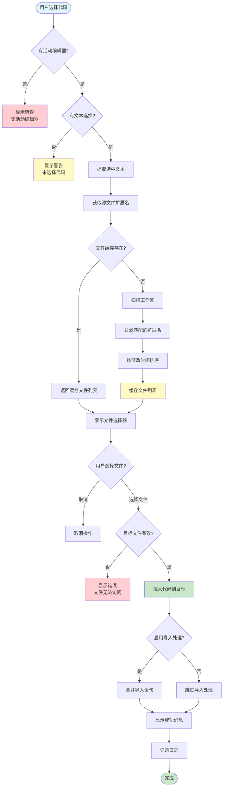

**Data Transformed:**
1. **Input:** Selected text from source editor
2. **Process:**
   - Source extension extraction
   - File discovery (cached or fresh scan)
   - User selection from quick pick
   - Target file validation
3. **Output:** Code inserted into target file
4. **Side Effect:** Target file modified on disk

**State Changes:**
- FileDiscoveryService cache possibly updated
- Target file modified (file system state)
- Log entry added
- Import statements possibly merged

## Context Variable Update Flow

Context variables are the mechanism for dynamic UI state management.

### Context Variable Update Sequence

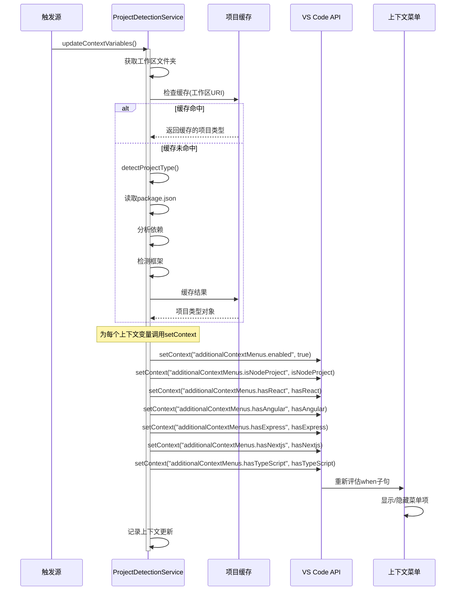

### Context Variable State Diagram

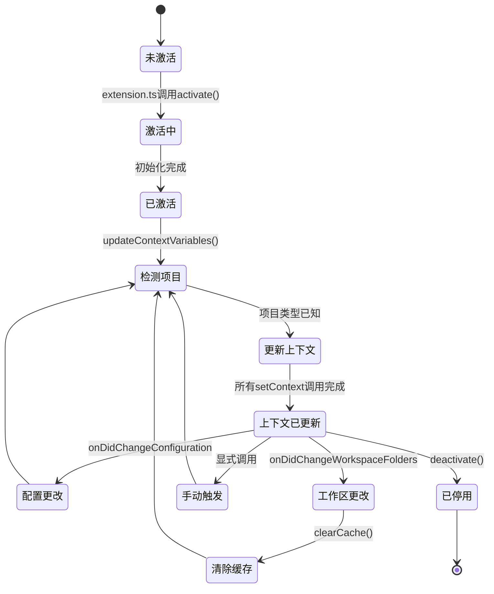

### Context Variable Data Flow Table

| Trigger | Source | Cache Action | Data Flow | UI Impact |
|---------|--------|--------------|-----------|-----------|
| **Activation** | ExtensionManager | Check cache | ProjectDetection → setContext → VS Code | Menus show/hide |
| **Configuration Change** | ContextMenuManager | Clear if auto-detect off | Config check → (optional) re-detect → setContext | Menus update |
| **Workspace Change** | ProjectDetectionService | Clear cache | Workspace folder change → re-detect → setContext | Menus update |
| **Manual Trigger** | Command handler | Optional cache clear | Direct call → setContext | Menus update |

## Cache Management Flow

Caching is used to optimize performance by avoiding expensive repeated operations.

### Cache Architecture

```mermaid
graph TB
    subgraph "FileDiscoveryService Cache"
        FDCache[Map&lt;string, CompatibleFile[]&gt;]
        FDKey["工作区URI + 扩展名"]
        FDValue[兼容文件列表]
    end

    subgraph "ProjectDetectionService Cache"
        PDCache[Map&lt;string, ProjectType&gt;]
        PDKey["工作区URI"]
        PDValue[项目类型对象]
    end

    subgraph "缓存生命周期"
        Create[创建: 首次调用]
        Read[读取: 缓存命中]
        Update[更新: 重新扫描]
        Invalidate[失效: 文件系统变化]
        Clear[清除: 工作区变化]
    end

    FDCache --> FDKey
    FDCache --> FDValue
    PDCache --> PDKey
    PDCache --> PDValue

    Create --> FDCache
    Create --> PDCache
    Read --> FDCache
    Read --> PDCache
    Invalidate --> FDCache
    Clear --> PDCache

    style FDCache fill:#c8e6c9
    style PDCache fill:#c8e6c9
    style Invalidate fill:#ffcdd2
    style Clear fill:#ffcdd2
```

### Cache Invalidation Flow

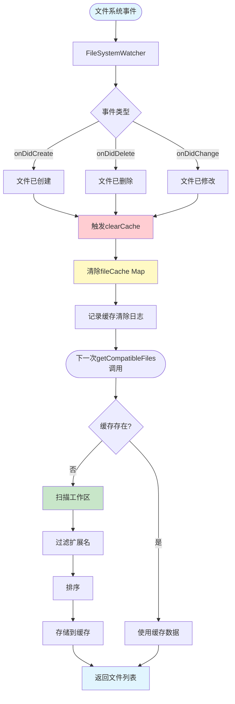

### Cache Data Structures

**FileDiscoveryService Cache:**
```typescript
// Key: "${workspaceUri.fsPath}:${sourceExtension}"
// Value: Array of compatible files
fileCache: Map<string, CompatibleFile[]>

interface CompatibleFile {
  name: string;
  path: string;
  extension: string;
  lastModified: number;
}
```

**ProjectDetectionService Cache:**
```typescript
// Key: workspaceFolder.uri.fsPath
// Value: Project type information
projectCache: Map<string, ProjectType>

interface ProjectType {
  isNodeProject: boolean;
  frameworks: string[];
  hasTypeScript: boolean;
}
```

### Cache Performance Characteristics

| Operation | Uncached Time | Cached Time | Speedup |
|-----------|---------------|-------------|---------|
| File Discovery | 100-500ms | <1ms | 100-500x |
| Project Detection | 10-50ms | <1ms | 10-50x |
| Memory Overhead | N/A | ~1-5MB | Acceptable |

## Configuration Change Flow

Configuration changes flow through the event system to update all affected components.

### Configuration Change Data Flow

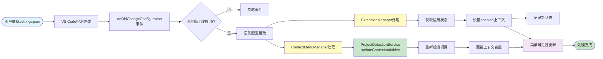

### Configuration State Transition

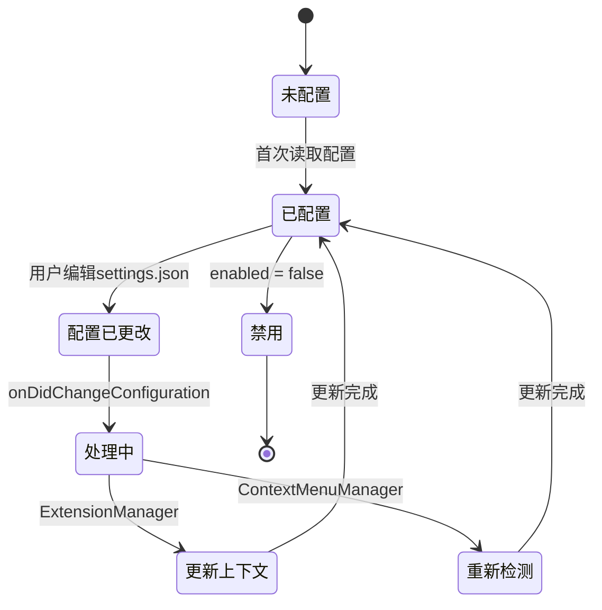

### Configuration Data Flow Details

**Data Changed:**
- `additionalContextMenus.enabled` - Master on/off switch
- `additionalContextMenus.autoDetect` - Auto-detection toggle
- `additionalContextMenus.handleImports` - Import merging toggle
- Terminal settings - Terminal behavior
- Other settings - Feature-specific configuration

**Components Affected:**
1. **ExtensionManager** - Updates `enabled` context variable
2. **ContextMenuManager** - Triggers project re-detection
3. **ProjectDetectionService** - Re-analyzes project if auto-detect enabled
4. **UI** - Menu visibility updates via context variables

## Error Handling Flow

Error handling is layered, with data flowing through logging, user notification, and graceful degradation.

### Error Handling Data Flow

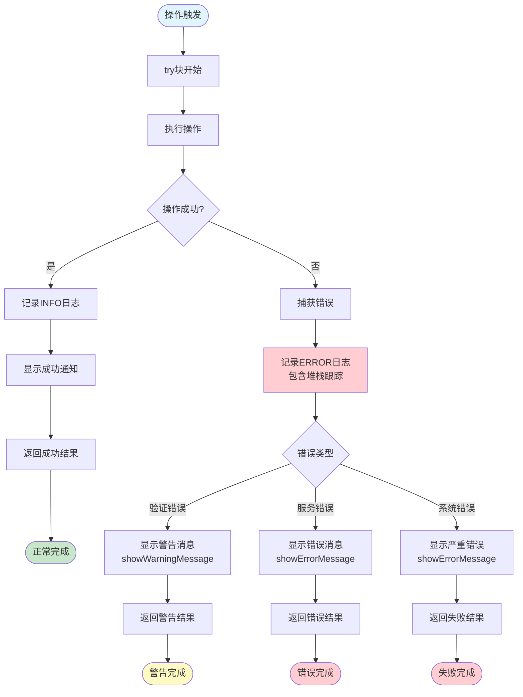

### Error Data Flow Examples

#### Example 1: No Active Editor

```mermaid
flowchart LR
    Trigger([命令触发]) --> Check{活动编辑器?}
    Check -->|否| Warn[showWarningMessage<br/>"无活动编辑器"]
    Check -->|是| Continue[继续操作]

    Warn --> Log[记录DEBUG日志<br/>"验证失败: 无活动编辑器"]
    Log --> Return[提前返回]
    Return --> End([命令完成])

    style Trigger fill:#e1f5fe
    style Warn fill:#fff9c4
    style End fill:#fff9c4
```

#### Example 2: File Access Denied

```mermaid
flowchart LR
    Operation([文件操作]) --> TryAccess[尝试访问文件]
    TryAccess --> Error{访问被拒绝?}

    Error -->|是| Catch[捕获异常]
    Error -->|否| Success[操作成功]

    Catch --> LogErr[记录ERROR日志<br/>包含文件路径和错误]
    LogErr --> UserMsg[showErrorMessage<br/>"文件无法访问或不可写"]
    UserMsg --> ReturnErr[返回错误结果]
    ReturnErr --> EndFail([失败])

    Success --> LogOk[记录INFO日志]
    LogOk --> ReturnOk[返回成功结果]
    ReturnOk --> EndOk([成功])

    style Operation fill:#e1f5fe
    style EndFail fill:#ffcdd2
    style EndOk fill:#c8e6c9
    style LogErr fill:#ffcdd2
```

### Error State Flow

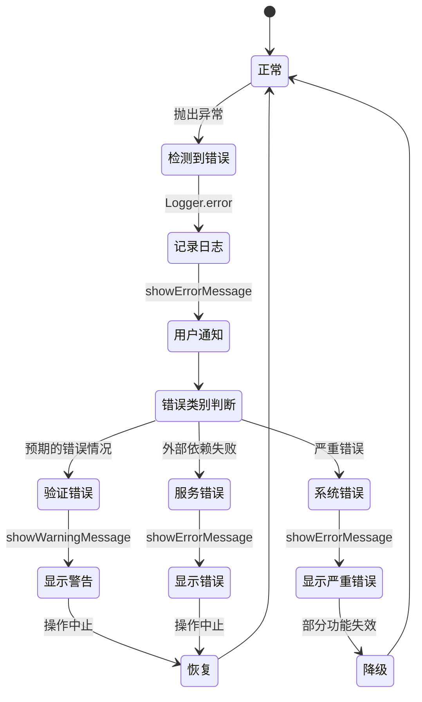

## Service Lifecycle Flow

Services follow a lifecycle from creation to disposal, with state managed throughout.

### Service Lifecycle Data Flow

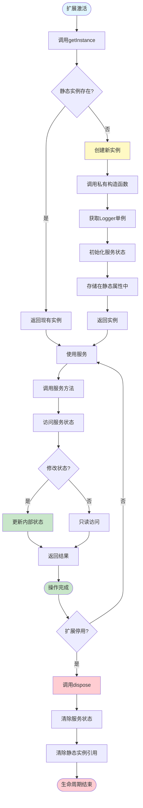

### Service State Management

| Service | State Type | Initialization | Disposal | Persistence |
|---------|-----------|----------------|----------|-------------|
| **Logger** | Output channel | Create on first use | Close channel | Session only |
| **ConfigurationService** | Config section name | Store in constructor | No state to clear | Session only |
| **ProjectDetectionService** | Cache Map | Create empty Map | Clear Map | Session only |
| **FileDiscoveryService** | Cache Map | Create empty Map | Clear Map | Session only |
| **CodeAnalysisService** | Regex patterns | Compile patterns | No state to clear | Session only |
| **FileSaveService** | No state | N/A | N/A | Stateless |
| **TerminalService** | No state | N/A | N/A | Stateless |

### Disposal Data Flow

```mermaid
flowchart LR
    Trigger([VS Code停用事件]) --> Entry[extension.ts<br/>deactivate调用]
    Entry --> EMDeactivate[ExtensionManager.deactivate]
    EMDeactivate --> EMDispose[ExtensionManager.dispose]

    EMDispose --> CMMDispose[ContextMenuManager.dispose]
    CMMDispose --> DisposeCmds[释放命令处理器]
    DisposeCmds --> DisposeEvents[释放事件监听器]
    DisposeEvents --> DisposeWatchers[释放文件监视器]

    DisposeWatchers --> Loop disposables[遍历disposables数组]
    Loop disposables --> TryDispose{尝试释放}
    TryDispose -->|成功| Next[下一个]
    TryDispose -->|失败| LogWarn[记录警告]
    LogWarn --> Next

    Next --> More{还有更多?}
    More -->|是| TryDispose
    More -->|否| ClearArray[清除disposables数组]

    ClearArray --> LoggerDispose[Logger.dispose]
    LoggerDispose --> CloseChannel[关闭输出通道]
    CloseChannel --> Complete([停用完成])

    style Trigger fill:#e1f5fe
    style Complete fill:#c8e6c9
    style CMMDispose fill:#fff9c4
    style LoggerDispose fill:#ffcdd2
```

## Data Transformation Pipeline

Data often goes through transformation pipelines as it flows through the system.

### File Discovery Pipeline

```mermaid
flowchart LR
    Input([输入: 源扩展名]) --> GetWorkspace[获取工作区URI]
    GetWorkspace --> GenKey[生成缓存键<br/>工作区 + 扩展名]

    GenKey --> Check{缓存中存在?}
    Check -->|是| ReturnCached[返回缓存列表]
    Check -->|否| Pattern[生成glob模式<br/>**/*.ext]

    Pattern --> FindFiles[vscode.workspace.findFiles]
    FindFiles --> Exclude[排除node_modules等]
    Exclude --> Map[映射到CompatibleFile对象]

    Map --> ExtractMeta[提取元数据<br/>名称, 路径, 修改时间]
    ExtractMeta --> Sort[按修改时间排序]
    Sort --> Cache[存储到缓存]
    Cache --> Return[返回文件列表]

    ReturnCached --> Output([输出: CompatibleFile[]])
    Return --> Output

    style Input fill:#e1f5fe
    style Output fill:#c8e6c9
    style Cache fill:#fff9c4
    style FindFiles fill:#c8e6c9
    style Map fill:#e1f5fe
```

### Code Analysis Pipeline

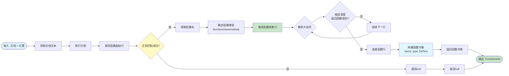

### Context Update Pipeline

```mermaid
flowchart LR
    Input([输入: updateContextVariables]) --> GetWorkspace[获取工作区文件夹]
    GetWorkspace --> CheckCache{缓存中存在?}

    CheckCache -->|是| UseCached[使用缓存的项目类型]
    CheckCache -->|否| ReadPackage[读取package.json]

    ReadPackage --> Parse[解析JSON]
    Parse --> DetectNode{检查node特性<br/>package.json存在?}

    DetectNode -->|是| SetNode[设置isNodeProject = true]
    DetectNode -->|否| SetNode[设置isNodeProject = false]

    SetNode --> CheckDeps[分析dependencies]
    CheckDeps --> CheckDevDeps[分析devDependencies]

    CheckDeps --> Frameworks{检测框架}
    CheckDevDeps --> Frameworks

    Frameworks --> React{包含react?}
    Frameworks --> Angular{包含@angular/core?}
    Frameworks --> Express{包含express?}
    Frameworks --> Nextjs{包含next?}

    React --> AddReact[添加到框架列表]
    Angular --> AddAngular[添加到框架列表]
    Express --> AddExpress[添加到框架列表]
    Nextjs --> AddNextjs[添加到Next.js列表]

    AddReact --> CheckTS{检查TypeScript<br/>.ts文件存在?}
    AddAngular --> CheckTS
    AddExpress --> CheckTS
    AddNextjs --> CheckTS

    CheckTS --> BuildType[构建ProjectType对象]
    BuildType --> Cache[缓存结果]
    Cache --> SetContexts[设置7个上下文变量]

    SetContexts --> Output([输出: 上下文已更新])

    style Input fill:#e1f5fe
    style Output fill:#c8e6c9
    style Cache fill:#fff9c4
    style SetContexts fill:#f3e5f5
```

## State Synchronization

Multiple state stores must stay synchronized for consistent behavior.

### State Synchronization Flow

```mermaid
flowchart TD
    Start([状态更改]) --> UpdateType{更改类型}

    UpdateType -->|配置更改| ConfigFlow[配置流]
    UpdateType -->|工作区更改| WorkspaceFlow[工作区流]
    UpdateType -->|文件系统更改| FSFlow[文件系统流]

    ConfigFlow --> ConfigState[更新配置状态]
    WorkspaceFlow --> ClearPDS[清除项目检测缓存]
    FSFlow --> ClearFDS[清除文件发现缓存]

    ClearPDS --> ReDetect[重新检测项目]
    ClearFDS --> ReScan[下次访问重新扫描]

    ReDetect --> UpdateContexts[更新上下文变量]
    ReScan --> UpdateContexts

    UpdateContexts --> SyncCheck{同步检查}
    SyncCheck --> UIState[UI状态更新<br/>菜单可见性]
    SyncCheck --> ServiceState[服务状态更新<br/>缓存/上下文]
    SyncCheck --> LogState[日志状态更新<br/>调试信息]

    UIState --> Verify{验证一致性}
    ServiceState --> Verify
    LogState --> Verify

    Verify -->|一致| Complete([同步完成])
    Verify -->|不一致| Retry[重试同步]
    Retry --> UpdateContexts

    style Start fill:#e1f5fe
    style Complete fill:#c8e6c9
    style ConfigFlow fill:#fff9c4
    style ClearPDS fill:#ffcdd2
    style ClearFDS fill:#ffcdd2
    style Verify fill:#e1f5fe
```

### State Consistency Rules

1. **Configuration State** ↔ **Context Variables**
   - When `enabled` config changes → `additionalContextMenus.enabled` context must update
   - Synchronization: Immediate via `onDidChangeConfiguration` handler

2. **Project Detection** ↔ **File Cache**
   - When workspace changes → Both caches must clear
   - Synchronization: `onDidChangeWorkspaceFolders` clears both

3. **File System** ↔ **File Cache**
   - When files change → File cache must invalidate
   - Synchronization: `FileSystemWatcher` events trigger cache clear

4. **All State** ↔ **Logger**
   - All state changes must be logged
   - Synchronization: Each state update includes logging call

## Data Flow Summary

### Key Data Flow Patterns

1. **Unidirectional Flow**
   - User → Command → Service → API → Result → User
   - Prevents circular dependencies
   - Easier to debug and reason about

2. **Cache-Aside Pattern**
   - Check cache → Use if hit → Compute and store if miss
   - Optimizes expensive operations
   - Automatic invalidation on changes

3. **Event-Driven Updates**
   - State changes via event handlers
   - Reactive rather than polling
   - Efficient resource usage

4. **Layered State Management**
   - UI state (context variables)
   - Service state (caches)
   - System state (VS Code API)
   - Clear separation of concerns

### Performance Characteristics

| Data Flow | Typical Duration | Bottlenecks | Optimization |
|-----------|------------------|-------------|--------------|
| Activation | ~50ms | Service initialization | Lazy loading |
| Command Execution | 10-500ms | File operations | Caching |
| Context Update | 1-50ms | Project detection | Cache first |
| Cache Invalidation | <1ms | Map.clear() | N/A |
| Configuration Change | 10-50ms | Context propagation | Event-driven |

### Data Flow Best Practices

1. **Always log state changes** - Enables debugging
2. **Validate input data** - Prevents errors downstream
3. **Use caching strategically** - Balance speed vs. memory
4. **Handle errors gracefully** - User-friendly messages
5. **Maintain consistency** - Keep related state synchronized
6. **Dispose properly** - Prevent memory leaks
7. **Use event listeners** - Reactive updates, not polling

## Related Documentation

- [Architecture Documentation](architecture.md) - Static structure and component relationships
- [System Design Documentation](system-design.md) - Activation sequences and command execution
- [Component Reference](component-reference.md) - Detailed API documentation for all components
